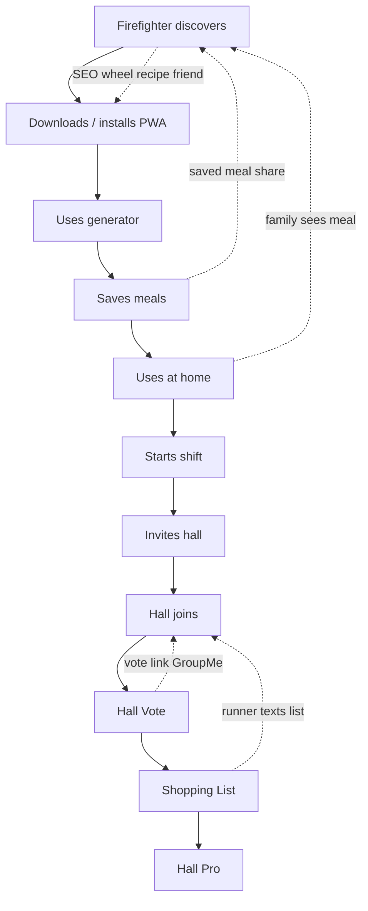

# Consumer-First Growth Engine

**Date:** June 22, 2026  
**Role:** Chief Growth Officer  
**Constraint:** **No paid ads.** Organic, referral, and product-led growth only.  
**Supersedes (partially):** `review/growth-master-plan.md` — that plan is hall-first. This plan is **firefighter-first**.

---

## CGO thesis (60 seconds)

Firefighters do not adopt software because a captain bought it. They adopt software because **it solved dinner last Tuesday** — at home, on shift, or both.

The old growth mistake: lead with Hall, QR on the fridge, and captain outreach. That works for the **last mile** of expansion, but it starves the top of the funnel.

The new engine:

```
One firefighter picks dinner in 90 seconds
    → saves it
    → uses it at home
    → brings it to the hall on shift
    → invites the crew
    → hall rituals (vote, list) stick
    → captain upgrades to Hall Pro
```

**SEO captures intent.** **The generator creates habit.** **Saves create lock-in.** **Shift night creates social proof.** **Hall invite creates network effects.** **Hall Pro monetizes the crew budget.**

Paid ads before this loop is proven would buy clicks into a product people have not yet felt at home. Organic growth means every touchpoint must **earn a share** — not ask for one.

---

## North Star cascade

| Level | North Star | Why |
|-------|------------|-----|
| **Consumer** | Weekly active picker (WAP) — generated or saved a meal in 7 days | Habit before hall |
| **Household** | 2+ saved meals + 1 home cook logged | Proves off-shift value |
| **Hall** | Hall with ≥3 members and ≥1 vote in 14 days | Network ignition |
| **Revenue** | Paying Hall Pro hall with 4-week retention | Crew budget, not individual guilt |

**Leading indicators (weekly):**

- `personal_onboarding_completed` (personal path)
- `meal_generated` + `recipe_save` per new user
- `pwa_installed`
- `hall_invite_sent` / `hall_invite_accepted`
- `hall_vote_shared` → `hall_joined`
- `shared_shopping_list_created` → `shared_shopping_list_completed`
- Hall Pro trial start → paid conversion

---

## The funnel (designed end-to-end)



### Stage 0 — Discover (firefighter)

**Job:** "I need dinner ideas that fit my life."

| Channel | Mechanism | Asset |
|---------|-----------|-------|
| Google | 393+ SEO URLs (`/recipes/:slug`, guides, landings) | Recipe pages with generator CTA |
| Social | Wheel result screenshot, meal share card | `MealShareCard` 9:16 surface |
| Word of mouth | "What app is that?" after a good meal | Branded share footer on card |
| Academy / probie | Instructor mentions meal planning | `/fire-academy-meals` landing |
| Mutual aid | Cross-station recipe link | `/recipes/:slug` |

**Primary CTA:** Pick Tonight → `/generator`  
**Secondary CTA:** Spin the wheel → `/wheel`  
**Tertiary:** Browse recipes → `/explore`  
**Never lead with:** Join Hall, Hall Pro, Create organization

---

### Stage 1 — Download app (PWA install)

**Job:** "Put this on my phone like a real app."

| Trigger | Surface | Copy | Analytics |
|---------|---------|------|-----------|
| 2nd visit | `PwaInstallPrompt` | "Add to home screen — pick dinner in one tap" | `pwa_installed` |
| After 1st save | Earned install prompt (build) | "Keep your saves on your home screen" | `pwa_installed` source=post_save |
| After 3rd generation | Earned install prompt | "Your go-to shift dinner app" | `pwa_installed` source=post_gen |
| iOS Safari | Manual "Add to Home Screen" coach mark | 3-step GIF in FAQ | `pwa_install_help_viewed` |

**Growth rule:** Install prompt fires **after value**, never on first landing. First visit = generator or wheel only.

---

### Stage 2 — Uses generator

**Job:** "Pick dinner in under 2 minutes."

| Touchpoint | Behavior | Referral potential |
|------------|----------|-------------------|
| Homepage hero | "Pick Tonight" primary | Link shared if user copies URL after wow |
| Onboarding step 2 | `/generator?onboarding=1` | New sign-ups land here automatically |
| One-tap defaults | Pre-set filters | Reduces bounce — more likely to share result |
| Wheel | `/wheel` — instant outcome | **Highest viral surface** — share card built |
| SEO recipe → generator | "Cook this tonight" on catalog pages | Long-tail inbound |

**Referral touchpoint #1 — Wheel share**

- **When:** Immediately after spin resolves
- **What:** `shareMealNative()` + `MealShareCard` preview
- **Message template:** "Tonight's pick: {meal} — spin your own: firehallmeals.com/wheel"
- **Recipient action:** Spin → generate → sign up to save
- **Metric:** `recipe_share` source=wheel

**Referral touchpoint #2 — Generator result share (build)**

- **When:** After 1st successful generation (not before — avoid sharing loading/errors)
- **What:** Share button on `RecipeCard` — link to recipe or "I picked this tonight"
- **Message:** "{meal} for crew of {n} — pick yours: firehallmeals.com/generator"
- **Metric:** `recipe_share` source=generator

---

### Stage 3 — Saves meals

**Job:** "Keep what worked."

| Touchpoint | Behavior | Referral potential |
|------------|----------|-------------------|
| Save on recipe card | `saveMeal()` → local + cloud sync | Saved library = switching cost |
| Onboarding step 3 | Prompted save in onboarding banner | 100% of new users hit save step |
| `/me/saved` | Personal library | Share a saved meal link to friend |
| Cloud sync | Sign-in value prop | "Your saves follow you to the hall" |

**Referral touchpoint #3 — Saved meal share**

- **When:** User taps share on a saved meal (build on favorites page)
- **What:** `/recipes/:slug` or deep link with UTM `?ref=save_share`
- **Message:** "We make this at our hall every month — {meal}"
- **Recipient:** Firefighter at another station → discovers app
- **Metric:** `recipe_share` source=saved_meals

**Referral touchpoint #4 — Email capture (existing)**

- **When:** After save or 2nd generation (`scheduleEarnedEmailCapture`)
- **What:** Magic link + weekly meal ideas
- **Referral angle:** Email footer "Forward to a crew member" (content, not product spam)

---

### Stage 4 — Uses at home

**Job:** "This works when I'm not at the station."

| Touchpoint | Behavior | Referral potential |
|------------|----------|-------------------|
| Home cook (no hall) | Generator + saved meals + wheel | Family sees phone / smells food |
| Cook Mode | Step-by-step at home kitchen | Completion = pride moment |
| Shift reminder (profile) | Opt-in "shift night" nudge | Bridges home habit → shift night |
| Measurement / list | Personal shopping list modal | Partner sees app utility |

**Referral touchpoint #5 — "Cooked it" share (build)**

- **When:** Cook Mode "Done cooking" (personal, no hall required)
- **What:** Optional share — photo-less text + meal link
- **Message:** "Made {meal} tonight — crew-sized recipe: {url}"
- **Metric:** `meal_cooked` + `recipe_share` source=cook_complete

**Referral touchpoint #6 — Household spillover (organic, not in-app)**

- **Mechanism:** Firefighter cooks at home; spouse/partner asks about app
- **Product support:** PWA install on second device; same account sync
- **Future:** Family portion toggle (not required for growth design)

**Growth insight:** Home use is the **trust bridge**. A firefighter who used the app at home will advocate on shift. Prompt hall connection **after** home success, not at sign-up.

---

### Stage 5 — Starts shift

**Job:** "Tonight's shift — I know what I'm doing."

| Touchpoint | Behavior | Referral potential |
|------------|----------|-------------------|
| Shift reminder notification | Opens app on shift day | Deep link to `/tonight` or `/generator` |
| `/tonight` hub | Operational home | "Start vote" visible if hall linked |
| `/home` app tab | Personal dashboard | Tonight CTA |
| Pre-shift generator | Same filters, crew size from profile | Fast path to meal |

**Referral touchpoint #7 — Shift reminder forward (build)**

- **When:** Captain or cook forwards reminder to group chat
- **What:** "What's for dinner tonight? Pick here: {link}"
- **Links to:** `/generator` (no hall) or `/tonight` (hall member)
- **Metric:** `shift_reminder_clicked` with attribution

---

### Stage 6 — Invites hall

**Job:** "My crew should use this too."

This is the **pivot from consumer to network**. It must feel optional, earned, and captain-friendly.

| Touchpoint | Who | Surface | Copy |
|------------|-----|---------|------|
| Onboarding step 5 | New user | `/onboarding/hall` | "Do you work at a fire hall?" |
| Me → Connect | Any user | `/hall/join` | Connect to Hall (optional) |
| Hall tab empty state | Member | `/hall` | "Invite your crew" |
| Hall settings | Captain | `HallInvitePanel` | Link, QR, 6-char code |
| After 3rd save (build) | Power user | Soft prompt | "Cooking with a crew? Connect your hall — free" |
| After 1st home cook + shift reminder on (build) | Engaged user | Soft prompt | "Bring this to your next shift" |

**Referral touchpoint #8 — Personal invite (peer)**

- **Who:** Any member (not only captain)
- **When:** User chooses "Yes" at onboarding or taps Connect
- **What:** `/hall/join?onboarding=1` or join code
- **Message:** "Join our hall on Firehall Meals — vote on dinner: {join_url}"
- **Methods:** Text, GroupMe, iMessage, QR print
- **Metric:** `hall_invite_sent` method=link|qr|code

**Referral touchpoint #9 — Captain invite kit (physical + digital)**

- **Who:** Captain / canteen manager
- **Assets:** Fridge QR PDF, 6-char code sticker, "Scan to vote" poster
- **Default URL:** `/hall/join?join_code=XXXX` (new hall) or `/vote/:id` (active vote)
- **Metric:** `hall_invite_sent` method=qr

**Referral touchpoint #10 — "Not ready" skip**

- **When:** `/hall/join?onboarding=1` skip
- **Why it matters:** Reduces resentment; user stays personal advocate
- **Follow-up:** Day 14 email — "Still cooking solo? Connect when your crew's ready"

---

### Stage 7 — Hall joins

**Job:** "I'm on the crew list in the app."

| Touchpoint | Behavior | Friction fix |
|------------|----------|--------------|
| `/hall/join?token\|code\|join_code` | Preview hall name before join | Skeleton preview exists |
| Magic link return | Preserve invite URL through auth | **P0 fix** if not shipped |
| Welcome | `/hall/welcome` | Crew tools overview |
| Land on Tonight | Post-join navigation | `/tonight` not `/hall` dashboard |

**Referral touchpoint #11 — Join confirmation share (build)**

- **When:** Immediately after successful join
- **What:** "I just joined {Hall Name} — vote on dinner here: {tonight_url}"
- **Audience:** Crew members still not in app
- **Metric:** `hall_invite_sent` method=post_join_nudge

**Viral coefficient target:** 0.3 new members per existing member per month from invites alone.

---

### Stage 8 — Hall Vote

**Job:** "We decided together."

| Touchpoint | Surface | Referral power |
|------------|---------|----------------|
| Start vote | `/tonight` → `HallVoteModal` | Captain creates decision moment |
| Share vote link | `/vote/:voteId` | **Highest hall viral loop** |
| Vote without account | Guest vote on link | Join CTA on results page |
| Results | Winner announced | "Cook this" → recipe → cook mode |

**Referral touchpoint #12 — Vote link (primary hall loop)**

- **When:** Captain taps Share in vote modal (`shareMealNative`)
- **What:** `/vote/:voteId`
- **Message:** "Vote by {time} — tonight's dinner: {url}"
- **Channels:** GroupMe, SMS, WhatsApp, station email
- **Non-member path:** Vote → see results → "Join {Hall}" CTA
- **Metric:** `hall_vote_shared` → `hall_invite_accepted`

**Referral touchpoint #13 — Vote result broadcast (build)**

- **When:** Vote closes
- **What:** Auto-generated "Winner: {meal}" card + tonight link
- **Captain one-tap:** Share to group
- **Metric:** `hall_vote_closed` + share

**Captain playbook (organic, no product):** Start vote **before** sharing QR. Crew gets value in 90 seconds.

---

### Stage 9 — Shopping List

**Job:** "Someone's going to the store — here's the list."

| Touchpoint | Surface | Referral power |
|------------|---------|----------------|
| Shared list | Hall settings / Tonight | Runner assignment |
| Export / share | `navigator.share` on list | Runner texts crew |
| List completion | Checked items | Social proof — "we actually used it" |
| Hall Pro gate | Paywall on shared list | Revenue trigger (not growth blocker for vote) |

**Referral touchpoint #14 — Runner share**

- **When:** Grocery runner assigned or opens list
- **What:** Shared list link or exported text
- **Message:** "Grocery run — add what we need: {list_url}"
- **Side effect:** Non-members see app utility
- **Metric:** `shared_shopping_list_exported`

**Referral touchpoint #15 — "Need anything?" canteen loop**

- **When:** Low stock on canteen item
- **What:** Tonight hub "Need Anything?" section
- **Referral:** Indirect — canteen manager becomes champion → Hall Pro

**Growth rule:** Free hall gets vote + basic collaboration. Shared list is the **Hall Pro upgrade story**, not a join blocker. Joining hall must stay free.

---

### Stage 10 — Hall Pro

**Job:** "The station budget pays for crew tools."

| Touchpoint | Who | Trigger |
|------------|-----|---------|
| Shared list paywall | Canteen manager | 2nd grocery run in a month |
| Staples / canteen | Manager | Coffee/paper towel pain |
| Advanced vote | Captain | Tie-breaks, recurring votes |
| Grocery planning | Manager | Protein deals pilot |
| Founding Hall program | Captain | 100 halls — 6 mo Pro free |

**Referral touchpoint #16 — Hall-to-hall referral (Founding Hall)**

- **When:** Day 30 retained hall
- **Who:** Captain email + in-app badge
- **Offer:** Refer a hall that hits retention → both get 6 months Pro free
- **Asset:** Forwardable QR kit PDF
- **Metric:** `referral_hall_created` (manual → productized later)

**Referral touchpoint #17 — Canteen manager peer intro**

- **When:** Paying Pro hall
- **Ask:** "Know another canteen manager?" — intro email template
- **Channel:** County chiefs meeting, mutual aid dinner

**Revenue without ads:** Hall Pro spreads through **canteen pain**, not homepage banners.

---

## Referral touchpoint master table

Every designed moment a user can spread the product organically.

| # | Name | Stage | Actor | Trigger | Channel | Link / asset | Event |
|---|------|-------|-------|---------|---------|--------------|-------|
| 1 | Wheel share | Generator | User | Spin result | SMS, IG story | `/wheel` | `recipe_share` |
| 2 | Generator share | Generator | User | 1st meal picked | Text | `/generator` | `recipe_share` |
| 3 | Saved meal share | Saves | User | Tap share on save | Text | `/recipes/:slug` | `recipe_share` |
| 4 | Email forward | Saves | User | Weekly email | Email | Homepage | — |
| 5 | Cook complete share | Home | User | Done cooking | Text | Recipe URL | `meal_cooked` |
| 6 | Household spillover | Home | Family | Smells food | Word of mouth | — | — |
| 7 | Shift reminder | Shift | User | Notification | Group chat | `/tonight` | `shift_reminder_clicked` |
| 8 | Peer hall invite | Invite | Member | Onboarding / Connect | Text, QR | `/hall/join` | `hall_invite_sent` |
| 9 | Captain QR kit | Invite | Captain | Hall create | Fridge poster | QR → join | `hall_invite_sent` |
| 10 | Skip follow-up | Invite | User | Skipped connect | Email day 14 | `/hall/join` | — |
| 11 | Post-join nudge | Join | New member | Just joined | GroupMe | `/tonight` | `hall_invite_sent` |
| 12 | Vote link | Vote | Captain | Vote open | GroupMe | `/vote/:id` | `hall_vote_shared` |
| 13 | Vote winner card | Vote | Captain | Vote closed | GroupMe | `/tonight` | build |
| 14 | Runner list share | Shop | Runner | Assigned | Text | List export | `shared_shopping_list_exported` |
| 15 | Canteen low stock | Shop | Manager | Item low | In-app | Tonight | `canteen_item_low` |
| 16 | Founding hall refer | Pro | Captain | Day 30 retained | Email | QR kit PDF | manual |
| 17 | Manager peer intro | Pro | Canteen mgr | Post-purchase | Email intro | `/for-canteen-managers` | — |
| 18 | SEO recipe link | Discover | Anyone | Google | Search | `/recipes/:slug` | `page_view` |
| 19 | Guide article | Discover | Anyone | Google | Search | `/guides/:slug` | `page_view` |
| 20 | Red Lead PDF | Discover | Lead | PDF download | Email | Red Lead page | `email_capture` |
| 21 | PWA "add for crew" | Install | User | 2nd visit | OS install | Home screen | `pwa_installed` |
| 22 | Mutual aid meal | Discover | Cook | Cross-station event | In person | Recipe card print | — |
| 23 | Academy kit | Discover | Instructor | Class | Slide deck | `/fire-academy-meals` | — |
| 24 | Instagram meal card | Discover | User | Share card screenshot | IG/TikTok | Branded 9:16 | `recipe_share` |
| 25 | Lights & Sirens bridge | Trust | Founder | Footer / about | Credibility | lightsandsirens.com | — |

**Build priority (product):** #2, #3, #5, #11, #13 — highest leverage for consumer-first loop.  
**Already shipped:** #1, #8–9, #12, #14, #18–21, onboarding hall question.

---

## Organic acquisition channels (no paid ads)

### 1. Product-led (70% of effort)

| Loop | K-factor target | Engine |
|------|-----------------|--------|
| Wheel → share → spin | 0.15 | Visual outcome + one tap share |
| Generator → save → sync | Retention | Account + library |
| Vote link → join | 0.25 per vote | Group chat native behavior |
| QR → join → vote | 0.30 per hall/mo | Physical fridge |

### 2. SEO / content (20%)

- **393 URLs** already indexed — optimize CTAs to generator, not hall join
- Every recipe page: "Pick this tonight" → `/generator?meal=:slug` (build)
- Guides: shift-night framing, link to wheel
- Landings: firefighter-first copy (shipped in homepage rewrite)

### 3. Community (10%)

| Channel | Tactic | Frequency |
|---------|--------|-----------|
| Facebook VFD groups | Meal photo + "how we pick dinner" — DM for link, no spam | 2×/week |
| Firehouse.com / forums | Helpful threads, not ads | 1×/week |
| Reddit r/Firefighting | Answer "shift meal ideas" with genuine help | As relevant |
| LinkedIn | Founder story — firefighter who built for crews | 2×/month |
| Instagram/TikTok | 15-sec wheel spins, real meals | 3×/week |
| Podcast guesting | Fire service podcasts — dinner chaos angle | 1×/month |

### 4. Physical (high conversion, low volume)

| Asset | Destination | When to ship |
|-------|-------------|--------------|
| Fridge QR poster | `/hall/join?join_code=` | Week 1 |
| Laminated Tonight card | `/tonight` | Week 2 |
| Helmet sticker | `/wheel` | Month 2 |
| Academy slide deck | Live vote demo | Month 2 |
| Mutual aid neighbor kit | Printed QR + captain letter | Month 1 |

### 5. Partnerships (no cash)

| Partner | Exchange |
|---------|----------|
| State fire associations | Newsletter blurb → founding hall slots |
| Training academies | Free academy kit → probie installs |
| Grocery stores (local) | Flyer at checkout → protein deals later |
| IAFF locals | Canteen tool pitch → Hall Pro trial |

---

## Prompt timing rules (when to ask for growth actions)

**Never ask before value.**

| User state | Allowed prompt | Forbidden |
|------------|----------------|-----------|
| First 90 sec | Generate, spin | Sign-in wall, hall join, install |
| After 1st meal | Save, sign-in to sync | Hall Pro, invite crew |
| After 1st save | PWA install, profile | Hall join (unless onboarding step 5) |
| After 2nd session | Connect hall (soft) | Pro paywall |
| Hall member, no vote | Start vote (captain) | — |
| Hall vote active | Share vote link | — |
| 2+ grocery runs | Hall Pro trial (manager) | Individual Plus push |
| Day 30 retained hall | Refer another hall | — |

This aligns with `client/src/lib/onboarding/state.ts` personal-first funnel.

---

## Consumer → Hall expansion model

```
                    ┌─────────────────────┐
                    │  FIREFIGHTER (1)    │
                    │  Generator / Wheel  │
                    └──────────┬──────────┘
                               │
              ┌────────────────┼────────────────┐
              ▼                ▼                ▼
        ┌──────────┐      ┌──────────┐      ┌──────────┐
        │ Home use │      │  Saves   │      │   PWA    │
        └────┬─────┘      └────┬─────┘      └──────────┘
             │                 │
             └────────┬────────┘
                      ▼
              ┌───────────────┐
              │ Shift night   │
              │ (reminder)    │
              └───────┬───────┘
                      ▼
              ┌───────────────┐
              │ Invites 2–5   │  ← peer + captain
              │ crew members  │
              └───────┬───────┘
                      ▼
              ┌───────────────┐
              │ Hall Vote     │  ← viral link
              └───────┬───────┘
                      ▼
              ┌───────────────┐
              │ Shopping List │
              └───────┬───────┘
                      ▼
              ┌───────────────┐
              │ Hall Pro      │  ← captain budget
              └───────────────┘
```

**Implication for sales:** Do not sell halls cold. Sell **firefighters** through SEO and shares; let them pull the hall in.

---

## Firefighter Plus (individual revenue, parallel track)

Plus does not replace hall growth — it monetizes users who never connect a hall or want personal tools.

| Trigger | Offer |
|---------|-------|
| 10+ saves | Unlimited saves, meal calendar |
| Nutrition tap 3× | Full macros |
| Offline attempt | Offline cook mode |
| Personal deals interest | Firefighter Plus protein deals |

**Referral touchpoint #26 — Plus gift (future)**

- Gift 1 month Plus to a probie — word of mouth in academy

Keep Plus **invisible** during first 2 sessions. Consumer growth engine priority: **free personal habit**.

---

## Measurement dashboard (consumer-first)

Weekly growth review — consumer metrics first, hall metrics second.

| Tier | Metric | W4 target | W12 target |
|------|--------|-----------|------------|
| **Acquire** | New sign-ups | 200 | 1,000 |
| **Activate** | Onboarding complete (personal) | 60% | 70% |
| **Activate** | 1st generation < 2 min | 80% | 85% |
| **Retain** | W1 return (any meal action) | 35% | 45% |
| **Retain** | Saved ≥2 meals | 25% | 40% |
| **Expand** | PWA install rate | 15% | 25% |
| **Expand** | Hall connect (of completed onboarding) | 30% | 40% |
| **Network** | Halls with ≥3 members | 10 | 50 |
| **Network** | Votes / week | 20 | 150 |
| **Revenue** | Hall Pro trials | 3 | 25 |
| **Viral** | `recipe_share` / WAU | 0.1 | 0.2 |
| **Viral** | `hall_vote_shared` → joins | 15% | 25% |

---

## 12-week organic execution calendar

| Week | Consumer focus | Hall focus | Content |
|------|----------------|------------|---------|
| 1–2 | Ship generator + saved meal share buttons | Founder installs 3 halls manually | 5 wheel reels |
| 3–4 | PWA prompt after save | Vote-before-QR playbook PDF | Case study: one hall |
| 5–6 | Cook complete share | Post-join invite nudge | SEO CTA pass on top 50 recipes |
| 7–8 | Shift reminder attribution | Founding Hall page live | Facebook group campaign |
| 9–10 | Soft hall connect prompt (engaged users) | 25 halls, neighbor kits | Academy outreach ×5 |
| 11–12 | Firefighter Plus waitlist (optional) | Hall Pro trials | "50 halls" organic press |

---

## What not to do (anti-patterns)

| Anti-pattern | Why it kills consumer growth |
|--------------|------------------------------|
| Lead homepage with "Create Hall" | Firefighter isn't a buyer — they're hungry |
| Gate generator behind sign-in | Kills SEO → activation |
| Show Hall Pro before first vote | Feels corporate, not crew |
| Paid Meta/Google ads | Burns cash before loop proven; attracts wrong intent |
| Spam VFD Facebook with links | Banned + brand damage |
| Captain-only onboarding | 90% of users are members, not captains |
| Referral cash payouts before scale | Fraud + wrong incentives |

---

## Relationship to existing docs

| Doc | Role |
|-----|------|
| `growth-master-plan.md` | Hall acquisition playbook — use **after** consumer loop works |
| `firefighter-plus-architecture.md` | Individual monetization — parallel, not primary |
| `product-polish-final.md` | Tonight → Vote → Shop → Cook — hall retention mechanics |
| Personal onboarding (shipped) | Sign up → Generate → Save → Profile → Optional hall |

**Unified strategy:** Consumer engine fills the top; hall playbook converts engaged crews; Founding Hall program scales without ads.

---

## Summary

The growth engine is not a marketing campaign. It is **a sequence of earned shares**:

1. **Firefighter** discovers through SEO, wheel, or a friend's meal  
2. **Installs** after the app proves worth keeping  
3. **Generates** dinner in one tap  
4. **Saves** what works — personal lock-in  
5. **Uses at home** — trust without hall politics  
6. **Starts shift** — reminder brings app to the station  
7. **Invites hall** — optional, peer-driven  
8. **Hall joins** — free collaboration  
9. **Hall Vote** — the viral unit (GroupMe link)  
10. **Shopping List** — runner shares, manager upgrades  
11. **Hall Pro** — crew budget, captain buyer  

**No paid ads.** Every referral touchpoint is designed. **25 touchpoints** mapped; **5 product builds** prioritized to complete the consumer loop.

**Next product builds (growth-only):**

1. Share button on generator `RecipeCard` result  
2. Share on `/me/saved`  
3. Cook-complete share prompt  
4. Post-join "invite crew" nudge  
5. Vote-winner auto-share card  

**Next ops (no code):**

1. Fridge QR PDF with join code  
2. Captain "vote before QR" one-pager  
3. Founding Hall referral email at day 30  
