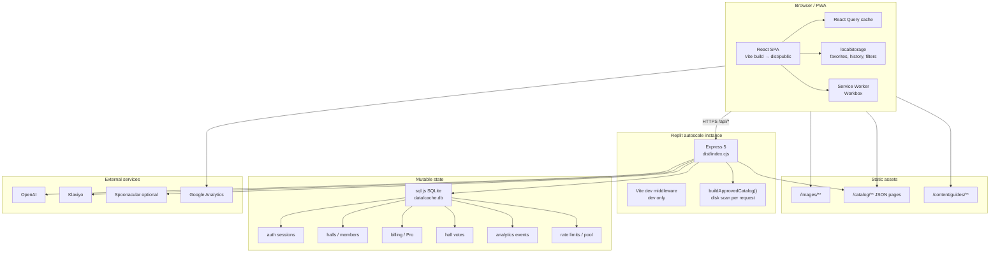
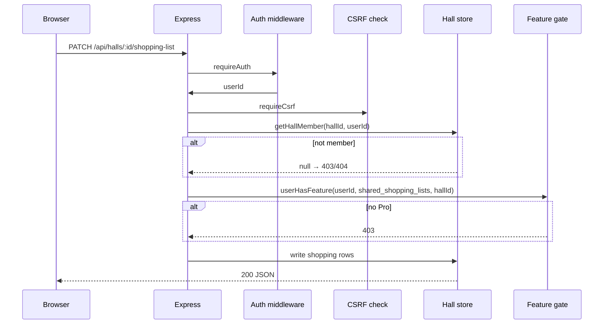

# Firehall Meals — Final CTO Technology Audit

**Date:** June 25, 2026  
**Lens:** CTO · architecture · scalability · security · maintainability  
**Scope:** Technology only — not product, UX, or marketing  
**Validation:** `npm install`, `npm run check`, `npm run build` pass; dev `/api/health` healthy; codebase walkthrough of `server/`, `client/`, `shared/`, `scripts/`, CI workflows

---

## Executive summary

Firehall Meals is a **well-instrumented early-stage monolith** optimized for **solo/small-team velocity** on Replit, not yet for **multi-tenant hall scale**. The stack is coherent: TypeScript end-to-end, React + Vite SPA, Express 5 API, static catalog JSON on disk, sql.js SQLite for mutable state.

**Strengths:** Strong validation culture (50+ scripts in `npm run check`), Zod at API boundaries, CSRF on mutations, hall membership checks on hall APIs, helmet in production, PWA shell, manual chunk splitting.

**Primary architectural risk:** **Single-file SQLite (`data/cache.db`) via sql.js WASM** holding auth, halls, billing, votes, analytics, and cache — with **debounced full-file rewrites** and **no WAL/concurrency model**. This is fine for **10–100 halls** on one Replit instance; it becomes the **first hard ceiling** before 1,000 halls or horizontal scale.

**Secondary risks:** 3,200-line `routes.ts`, `buildApprovedCatalog()` rebuilt on every catalog API hit, 186 npm scripts, vestigial PostgreSQL/Drizzle/Passport dependencies, CI that runs `npm audit` but not `npm run check`.

**Overall technology score: 71 / 100**  
(Mature for pre-PMF; not yet “scale-ready” without targeted hardening.)

**Would I keep this stack as CTO?** **Yes — with surgical changes**, not a rewrite. Replace complexity with **caching, CI, backup discipline, and route modularization** before considering Postgres migration.

---

# STEP 1 — Technology Inventory

## Stack map

| Layer | Technology | Role in Firehall Meals |
|-------|------------|------------------------|
| **Language** | TypeScript 5.6 | Shared types across client/server |
| **Frontend** | React 18 | UI |
| **Bundler** | Vite 7 | Dev server + production client build |
| **Routing** | Wouter 3 | Client-side routes (lightweight vs React Router) |
| **State / server cache** | TanStack React Query 5 | API caching, stale times on catalog |
| **Styling** | Tailwind 3 + tailwindcss-animate | Utility-first CSS |
| **Components** | shadcn/ui (Radix primitives) | Accessible UI kit |
| **Forms** | react-hook-form + Zod resolvers | Typed forms |
| **Animation** | Framer Motion 11 | Wheel, transitions |
| **Charts** | Recharts 2 | Admin analytics only (lazy) |
| **Backend** | Express 5 | HTTP API + static SPA serve |
| **Server bundle** | esbuild | Single `dist/index.cjs` (~3.3 MB) |
| **Primary database** | **sql.js (SQLite WASM)** | `data/cache.db` — auth, halls, billing, votes, analytics, rate limits, curated metadata |
| **ORM (vestigial)** | Drizzle ORM + drizzle-kit | Configured for PostgreSQL; **runtime path uses raw SQL on sql.js** |
| **PostgreSQL deps** | `pg`, `connect-pg-simple` | **In package.json; not used on hot path** |
| **Catalog storage** | Static JSON in `client/public/catalog/` | 300+ recipe pages, indexes, guides |
| **Image assets** | Static files `client/public/images/` | Slug-locked heroes/thumbs; build-time sitemap |
| **Image generation** | OpenAI API + optional `sharp` | Food imagery pipeline (scripts + server) |
| **Auth** | Custom cookie sessions | `fh_auth` cookie → SHA-256 hashed token in SQLite |
| **CSRF** | Double-submit cookie | `csrf_token` cookie + `X-CSRF-Token` header |
| **Admin auth** | `ADMIN_SECRET` header/query | Fails closed (503 if unset) |
| **Session store** | SQLite (not Redis/memorystore hot path) | `memorystore` in deps, unused in auth flow |
| **Passport** | In dependencies | **Not wired** in `auth-store.ts` |
| **Caching** | In-process + SQLite tables | Rate limits, recipe pool, generation cache |
| **Search** | In-memory filter on approved catalog | No Elasticsearch/Typesense; static JSON scan |
| **Analytics** | GA4 (`gtag`) + internal SQLite events | `client/src/lib/analytics.ts`, `server/analytics/` |
| **Email** | Klaviyo API | Subscribe, lead magnets, recipe email |
| **Background jobs** | **None** (no queue) | Scripts run via npm/CI; no Bull/SQS |
| **PWA** | vite-plugin-pwa + Workbox | Precache shell; runtime cache for images/API |
| **Offline** | PWA shell + offline banner | Cook mode/recipes not fully offline-first |
| **Hosting** | Replit autoscale | `.replit` → `node dist/index.cjs`, `PORT=5000` |
| **Deployment** | `npm run build` → `dist/` | Guides + sitemap + PWA icons at build time |
| **Monitoring** | Custom logger + `/api/health` | Startup diagnostics; no Datadog/Sentry |
| **Logging** | `server/logger.ts` | HTTP summary logs; production 500 masking |
| **Testing** | **tsx integration scripts** | `scripts/test-*.ts`, `scripts/audit-*.ts` — no Jest/Vitest/Playwright |
| **CI/CD** | GitHub Actions (partial) | `security-audit.yml` (npm audit only); ingest workflows |
| **Payments** | Billing store in SQLite | **No Stripe SDK** in dependencies; scaffold only |
| **Security headers** | Helmet | CSP in production |
| **Rate limiting** | SQLite-backed sliding window | Generation, explore, email endpoints |
| **WebSocket** | `ws` in dependencies | **No active real-time vote channel** — vote is poll/HTTP |
| **External APIs** | OpenAI, Klaviyo, Spoonacular (optional), Apify (ingest scripts) | |

## Architecture diagram



## Data flow (hall-scoped write)



---

# STEP 2 — Technology Scorecard

Scores **1–10**. Weighted for **100+ active halls**, not theoretical hyperscale.

| Technology | DX | Maintain | Scale | Perf | Reliability | Security | Cost | Lock-in | Community | 5yr viability | Notes |
|------------|---:|---------:|------:|-----:|------------:|---------:|-----:|----------:|----------:|--------------:|-------|
| **TypeScript** | 9 | 9 | 8 | 8 | 8 | 7 | 9 | 3 | 10 | 10 | Shared `shared/` types are a force multiplier |
| **React 18** | 9 | 8 | 9 | 7 | 9 | 8 | 9 | 4 | 10 | 9 | Industry default; team hireable |
| **Vite 7** | 9 | 8 | 8 | 8 | 8 | 8 | 10 | 4 | 9 | 9 | Fast builds; Replit plugins add env coupling |
| **Wouter** | 8 | 7 | 8 | 9 | 8 | 8 | 10 | 5 | 7 | 8 | Fine at current route count; watch if routes 2× |
| **React Query** | 9 | 9 | 8 | 8 | 8 | 8 | 10 | 5 | 10 | 9 | Correct choice for API-heavy SPA |
| **Tailwind + shadcn** | 8 | 7 | 9 | 7 | 9 | 8 | 10 | 4 | 10 | 9 | Large Radix surface; prune unused components |
| **Express 5** | 8 | 6 | 7 | 7 | 8 | 7 | 10 | 3 | 9 | 8 | `routes.ts` monolith hurts maintainability |
| **sql.js SQLite** | 7 | 6 | **4** | 6 | **5** | 6 | 10 | 6 | 7 | 7 | Great for dev/Windows; **scale bottleneck** |
| **Static JSON catalog** | 8 | 8 | **9** | 7 | 9 | 9 | 10 | 2 | N/A | 9 | Excellent for read-heavy recipe SEO |
| **esbuild server bundle** | 8 | 7 | 7 | 8 | 8 | 8 | 10 | 5 | 8 | 8 | Fast cold start; 3.3 MB bundle acceptable |
| **Custom auth (cookies)** | 7 | 7 | 7 | 9 | 7 | 7 | 10 | 7 | N/A | 8 | Simple; needs session rotation doc |
| **Helmet + CSRF** | 7 | 8 | 9 | 9 | 8 | **8** | 10 | 3 | 8 | 9 | Solid baseline for mutations |
| **PWA / Workbox** | 7 | 7 | 8 | 7 | 7 | 7 | 10 | 5 | 8 | 8 | Shell offline OK; don't over-promise cook offline |
| **OpenAI imagery** | 6 | 6 | 6 | 5 | 6 | 6 | **4** | 8 | 9 | 8 | Cost risk at scale; gate with budget env |
| **Klaviyo** | 7 | 8 | 8 | 8 | 8 | 7 | 6 | 7 | 8 | 8 | Fine for email volume at 100 halls |
| **tsx script tests** | 6 | 5 | 5 | N/A | 7 | N/A | 10 | 8 | 6 | 7 | High coverage, low ergonomics vs Vitest |
| **Replit hosting** | 8 | 7 | 6 | 7 | 7 | 7 | 7 | **8** | 6 | 7 | Fast ship; plan exit before 1k halls |
| **Drizzle/Postgres (unused)** | 3 | **2** | N/A | N/A | N/A | N/A | N/A | N/A | 9 | 9 | **Dead config — misleading** |

**Stack average (active technologies): ~7.4 / 10**

---

# STEP 3 — Architecture Review

| Area | Assessment | Severity | Risk | Solution | Effort |
|------|------------|----------|------|----------|--------|
| **Project structure** | `client/`, `server/`, `shared/`, `scripts/` clear; `routes.ts` 3,200+ lines | High | Merge conflicts, slow onboarding | Split into `server/routes/*.ts` by domain | M |
| **Folder organization** | Domain stores (`hall-*`, `billing`, `auth`) good | Low | — | Keep pattern for new features | S |
| **Component organization** | `components/`, `pages/`; legacy explore orphans documented in `dead-code-audit.md` | Medium | Engineer confusion | Delete Phase 1 dead files | S |
| **Server architecture** | Single Node process, sync catalog build on request | High | CPU under SEO spike | In-memory catalog cache + `assetRevision` invalidation | S |
| **API architecture** | REST JSON, Zod validation, consistent `{ message }` errors | Low | — | OpenAPI spec optional at 50 halls | M |
| **State management** | React Query + localStorage + sync coordinator | Medium | Stale hall state, double sync | Single hall detail query key; debounce sync | S |
| **Database schema** | Per-store `CREATE TABLE` in init functions; shared Zod schemas | Medium | Schema drift | Central migration manifest (even for SQLite) | M |
| **Migrations** | `drizzle-kit` expects Postgres; SQLite is ad-hoc `ALTER` in code | High | Prod schema drift | Versioned SQL migrations for `cache.db` | M |
| **Auth flow** | Cookie → SHA-256 token → SQLite session row | Low | — | Document session fixation handling | XS |
| **Permissions** | Role-based `permissionsForRole`; `getHallDetail` returns null if not member | Low | IDOR if route skips check | Lint rule: hall routes must call member check | S |
| **Feature flags** | Billing features in `shared/billing/types.ts` | Low | Ghost flags removed from Pro | Remove deprecated keys from DB over time | S |
| **Caching strategy** | Client RQ staleTime; server catalog **uncached** | **Critical** | Explore slowness | `let catalogCache` with mtime check | XS |
| **Image management** | Slug-locked paths + `audit:hero-images` in CI | Low | Wrong bytes at right path (mitigated) | Vision cache in CI when key present | S |
| **Build process** | Guides + sitemap + icons + Vite + esbuild | Low | Long builds | Cache guide generation in CI | S |
| **Bundle strategy** | manualChunks for vendors; **Generator eager in App** | High | Mobile LCP | Lazy `Generator`, lazy admin pages | S |
| **Code splitting** | 50+ lazy pages; main chunk still 1.28 MB | High | First paint | Split home vs generator graphs | S |
| **Environment** | `dotenv`, `env-bootstrap.ts`, Replit shared env | Medium | Secret leak in logs | Secret allowlist in logger | S |
| **Configuration** | `FOOD_IMAGERY_*`, `PROTEIN_DEALS_MODE`, etc. | Medium | Config sprawl | `server/config/` typed config module | M |
| **Dependencies** | `pg`, `passport`, `connect-pg-simple`, `memorystore` unused | Medium | Supply chain noise | Remove or document as intentional | XS |
| **Technical debt** | 186 npm scripts, duplicate recipe stacks | High | Maintainer burnout | Script tiers: `check`, `audit`, `maintenance` | M |

---

# STEP 4 — Scalability Audit

| Scale target | Verdict | First breaking point |
|--------------|---------|----------------------|
| **10 halls** | **Comfortable** | None if single Replit instance |
| **100 halls** | **OK with fixes** | Catalog API CPU; SQLite write contention on vote + analytics spikes |
| **1,000 halls** | **Breaks without changes** | Single `cache.db` file; full DB export on every write batch; no horizontal scale |
| **10,000 halls** | **Not supported** | Replit single-tenant disk; auth/session on one file; no read replicas |
| **100,000 users** | **Partial** | Static recipe pages scale on CDN; API/auth on SQLite does not |
| **Millions of recipe views** | **Yes (static)** | `/recipes/*`, images, guides are static — CDN handles; API endpoints must not be hit per view |
| **Large SEO traffic** | **Yes with CDN** | Ensure catalog count API cached; avoid dynamic SSR for recipes |
| **Real-time Hall Vote** | **Poll-based OK** | Not WebSocket; fine for 50 voters/vote; refresh is HTTP GET |
| **Shopping list collaboration** | **OK <100 halls** | Last-write-wins SQLite; no OT/CRDT — conflicts possible |
| **Protein Deals** | **OK** | Read-heavy; indexed queries in store |
| **Background jobs** | **N/A today** | Long imagery scripts block terminal; need queue at scale |
| **Email campaigns** | **OK** | Klaviyo handles send scale |
| **Offline cooking** | **Partial** | PWA caches shell + some API; recipe JSON not fully precached |

### Where architecture breaks **first**

1. **`buildApprovedCatalog()` on every `/api/catalog/approved` request** — O(recipes × disk I/O × hero audit) per hit  
2. **sql.js persist** — debounced full-file `writeFileSync` under concurrent writes  
3. **Single Replit instance** — no sticky sessions needed today, but no multi-instance path  
4. **Authenticated global hall fetch** — `HallMembershipProvider` loads hall detail on every page for logged-in users  

**At 100 halls:** Fix #1 and #4 before anything else.  
**At 1,000 halls:** Plan managed SQLite (Turso/LibSQL) or Postgres migration for mutable data only; keep static catalog on disk/CDN.

---

# STEP 5 — Security Audit

| Area | Status | Level |
|------|--------|-------|
| **Authentication** | HttpOnly-style session cookie pattern; tokens hashed at rest | OK |
| **Authorization** | Hall routes check membership via `getHallDetail` / store guards | OK |
| **Session handling** | 30-day sessions; no rotation documented | Medium |
| **Secrets** | `ADMIN_SECRET`, API keys via env; dev bypass for golden-100 admin routes | Medium |
| **SQL injection** | Parameterized `prepare().run()` throughout stores | Low risk |
| **XSS** | React default escaping; user content limited | Low–Medium |
| **CSRF** | Enforced on mutations (`requireCsrf`) | Good |
| **Rate limiting** | Generation, explore, email | Good |
| **Hall isolation** | `getHallDetail` returns null if not member; Pro features check `hall_id` | Good |
| **Billing security** | `userHasFeature` on shopping, canteen, protein deals APIs | Good (recent hardening) |
| **Admin routes** | `requireAdmin` + secret; 503 if unset | Good |
| **File uploads** | No public multipart upload surface found | Low |
| **API abuse** | Rate limits + CSRF; no WAF | Medium |

### Risk register

| ID | Risk | Severity | Notes |
|----|------|----------|-------|
| S1 | SQLite file theft = full user/hall data | **Critical** | Encrypt Replit volume; restrict file access |
| S2 | No `npm run check` in CI | **High** | Regressions ship via merge |
| S3 | Dev admin bypass on golden-100 routes | **High** | Production OK; document never enable in prod |
| S4 | Session fixation / no explicit rotation | Medium | Add rotation on login |
| S5 | Vestigial deps (`passport`, `pg`) | Low | Attack surface in supply chain |
| S6 | `npm audit` 3 vulns (moderate/high) | Medium | CI runs high+ only |
| S7 | Vote fingerprint = IP + UA hash | Medium | Shared NAT collisions; acceptable for abuse prevention |
| S8 | No centralized error tracking | Medium | Blind to prod exceptions |
| S9 | Klaviyo/OpenAI keys in env | Medium | Standard secret hygiene |
| S10 | CSP enabled only in production | Low | Correct split |

---

# STEP 6 — Performance Architecture

### Current baseline (June 2026 build)

| Metric | Value |
|--------|------:|
| Main chunk `index-*.js` | 1,281 KB / 351 KB gzip |
| Explore chunk | 76 KB / 24 KB gzip |
| PWA precache | ~2.9 MB (shell only; images excluded) |
| Server bundle | 3.3 MB |
| Approved catalog API | Rebuilt from disk each request |

### Do now (before 100 halls)

| Item | Impact | Effort |
|------|--------|--------|
| In-memory cache for `buildApprovedCatalog()` | **Critical** — Explore/grid latency | XS |
| Lazy-load `Generator` in `App.tsx` | **High** — first-load JS −200–350 KB | S |
| Cache `/api/catalog/approved` with `Cache-Control` + `assetRevision` | High | XS |
| Stop global hall detail fetch on non-hall routes | Medium | S |
| Dedupe protein deals + hall API calls on dashboard | Medium | XS |
| Fix `explore-image-mapping` node:fs client import warning | Medium | S |
| Explore catalog grid: server-side pagination already exists — ensure default page size lean | Low | XS |

### Later (100–1,000 halls)

| Item | When |
|------|------|
| Turso/LibSQL or Postgres for `cache.db` | >200 concurrent writes/min |
| Redis for rate limits + catalog cache | Multi-instance deploy |
| CDN in front of `dist/public` | Traffic >10k DAU |
| Full-text search (Typesense/Meilisearch) | User search expectations rise |
| WebSocket or SSE for live vote tallies | Product requires real-time |

### Never (pre-100 halls)

| Item | Why |
|------|-----|
| Microservices | Premature |
| Kubernetes | Premature |
| GraphQL | REST is fine |
| Rewrite in Next.js | No SSR requirement for core app |
| IndexedDB recipe mirror | PWA shell sufficient |
| Lighthouse-only sprints | Measure TTI to first meal pick instead |

---

# STEP 7 — Technology Decisions

| Technology | Decision | Rationale |
|------------|----------|-----------|
| **React** | **KEEP** | Team velocity, ecosystem |
| **Vite** | **KEEP** | Best-in-class DX |
| **SQLite (sql.js)** | **KEEP** → **POSTPONE** migration to 500+ halls | Right for now; document ceiling |
| **Drizzle + Postgres config** | **REMOVE** or **POSTPONE** | Misleading; only `shared/models/chat.ts` uses Drizzle |
| **React Query** | **KEEP** | Correct abstraction |
| **Tailwind** | **KEEP** | |
| **shadcn/Radix** | **KEEP** — prune unused | |
| **TypeScript** | **KEEP** | |
| **Current auth** | **KEEP** | Simple; add rotation later |
| **Current analytics** | **KEEP** | Add Sentry later |
| **Replit hosting** | **KEEP** to 100 halls | Plan portable deploy script |
| **Current deployment** | **KEEP** | `build` → `node dist/index.cjs` is sound |
| **Image pipeline** | **KEEP** | Slug-locked + CI audit is right pattern |
| **In-memory search** | **KEEP** to 100 halls | |
| **PWA approach** | **KEEP** | Don't expand offline scope yet |
| **tsx script testing** | **KEEP** — add Vitest **POSTPONE** | Scripts work; add Vitest for units only |
| **Billing architecture** | **KEEP** | Add Stripe webhook module when product ready |
| **Wouter** | **KEEP** | |
| **Express monolith** | **KEEP** — **SIMPLIFY** routes split | |
| **passport / pg / memorystore** | **REMOVE** | Unused dependencies |
| **186 npm scripts** | **SIMPLIFY** | Tier and archive |
| **WebSocket (`ws`)** | **REMOVE** if unused | Dead dependency |
| **Octokit** | **POSTPONE** remove | Verify ingest scripts still need it |

---

# STEP 8 — Future Roadmap

## Next 30 days

| Area | Action |
|------|--------|
| **Infrastructure** | Daily `cache.db` backup to object storage; health check alerting |
| **Database** | Migration version table in SQLite; document restore procedure |
| **Performance** | Catalog in-memory cache; lazy Generator |
| **Monitoring** | Sentry (or Replit logs export) on 500 errors |
| **Testing** | Add `npm run check` to GitHub Actions on PR |
| **Deployment** | Document rollback: previous `dist/` artifact |
| **Automation** | Post-deploy smoke: `/api/health` + `/api/catalog/approved/count` |
| **Developer tooling** | `npm run check:fast` = tsc + critical tests only |
| **Security** | Remove unused deps; dependabot |
| **Cost** | OpenAI daily budget cap already in Replit env — enforce in code |

## Next 90 days

| Area | Action |
|------|--------|
| **Infrastructure** | Staging environment; separate `cache.db` |
| **Database** | Evaluate Turso if >50 halls with daily writes |
| **Performance** | HTTP cache headers on static catalog JSON |
| **Monitoring** | Dashboard: p95 `/api/catalog/approved`, error rate, SQLite persist latency |
| **Testing** | Vitest for `shared/` pure functions; keep integration scripts |
| **Deployment** | Blue/green on Replit or fly.io mirror |
| **Automation** | Scheduled `audit:hero-images` weekly |
| **Security** | Session rotation; annual pen test before Pro launch |
| **Cost** | Image CDN bandwidth review |

## Next year

| Area | Action |
|------|--------|
| **Infrastructure** | Multi-instance + shared DB when >500 halls |
| **Database** | Postgres or Turso for mutable; static catalog unchanged |
| **Performance** | Edge cache for SEO pages |
| **Monitoring** | Full observability (traces on generate path) |
| **Testing** | Playwright smoke on hall join + vote |
| **Deployment** | IaC (Terraform) if off Replit |
| **Automation** | Queue for imagery (BullMQ + Redis) if batch jobs grow |
| **Security** | SOC2-lite checklist if enterprise halls |
| **Cost** | Reserved capacity / CDN commit |

---

# STEP 9 — Technology Debt

| Category | Estimate | Maintenance ↓ | Bundle ↓ | Productivity ↑ |
|----------|----------|---------------|----------|----------------|
| Dead pages/components (~4,600 LOC) | `dead-code-audit.md` | High | ~0 KB (tree-shaken) | High |
| Duplicate recipe stack (`explore-recipe-detail-page`) | ~700 LOC | High | Small | High |
| `routes.ts` monolith | 3,200 LOC | Very high | 0 | Very high |
| Unused deps (`pg`, `passport`, `ws`?) | package.json | Low | Server | Medium |
| Drizzle Postgres config (unused) | drizzle.config.ts | Medium | 0 | Medium |
| 186 npm scripts (many redundant) | package.json | High | 0 | High |
| `buildApprovedCatalog()` per request | server | Medium | 0 | Medium |
| Global hall fetch on all pages | client | Medium | 0 | Medium |
| Legacy billing feature keys in DB | schema | Low | 0 | Low |
| Replit-only vite plugins | vite.config | Low | 0 | Low |

**Realistic wins from 2-week debt sprint:**

- Delete Phase 1 dead code: **~15% fewer client files to grep**
- Lazy Generator + catalog cache: **~25–35% faster first interactive**
- Split `routes.ts` into 8 modules: **~40% faster PR review on API changes**
- Remove 4 unused deps: **smaller `npm audit` surface**
- CI `npm run check`: **catch regressions before merge**

---

# STEP 10 — CTO Verdict

## Overall technology score: **71 / 100**

| Dimension | Score |
|-----------|------:|
| Architecture maturity | **68** — strong monolith patterns, weak scale path documented |
| Code quality / types | **78** — Zod + shared schemas |
| Operational readiness | **62** — health yes; monitoring/backup partial |
| Security baseline | **74** — CSRF, auth, hall isolation good |
| Performance engineering | **65** — good splitting, bad hot-path cache |
| Test / CI maturity | **70** — excellent scripts, weak CI wiring |
| Dependency hygiene | **60** — vestigial Postgres stack |

## Top 25 technology improvements

1. In-memory cache `buildApprovedCatalog()` with revision key  
2. Add `npm run check` to GitHub Actions on every PR  
3. Lazy-load `Generator` in `App.tsx`  
4. Split `server/routes.ts` into domain routers  
5. Daily automated `cache.db` backup  
6. Sentry (or equivalent) for production 500s  
7. Remove unused `pg`, `passport`, `connect-pg-simple`, `memorystore`  
8. Delete dead code per `dead-code-audit.md` Phase 1  
9. Versioned SQLite migrations (`schema_migrations` table)  
10. HTTP `Cache-Control` on catalog API responses  
11. Scope hall detail fetch to hall routes only  
12. `npm run check:fast` for local iteration  
13. Document SQLite restore + corruption handling (already partially in `sqlite.ts`)  
14. Consolidate duplicate recipe detail route to `/recipes/:slug`  
15. OpenAPI spec for hall + billing APIs  
16. Enforce OpenAI spend cap in server code  
17. Fix client bundle importing `node:fs` via explore-image paths  
18. Tier npm scripts (`check` / `audit` / `maintain`)  
19. Post-deploy smoke script in `deploy:prep`  
20. Session rotation on login  
21. Dependabot + monthly dep review  
22. Staging environment with separate DB  
23. Vitest for `shared/` pure functions  
24. Catalog JSON mtime-based server cache invalidation  
25. Plan Turso migration doc (mutable data only) before hall 200  

## Top 25 things NOT to change

1. TypeScript end-to-end  
2. React 18  
3. Vite build pipeline  
4. Express monolith (split files, not services)  
5. Static JSON catalog on disk/CDN  
6. Slug-locked image path convention  
7. `shared/` package for types and Zod schemas  
8. React Query for server state  
9. Wouter for routing  
10. Tailwind + shadcn design system  
11. Custom cookie auth (don't add Auth0 yet)  
12. CSRF double-submit pattern  
13. Zod request validation  
14. `npm run check` script suite (extend, don't replace)  
15. Helmet in production  
16. PWA shell strategy (exclude images from precache)  
17. esbuild server bundle  
18. Hall membership permission model  
19. `userHasFeature()` server gates on Pro APIs  
20. Rate limiting on generation endpoints  
21. Klaviyo for email (not custom SMTP)  
22. Build-time sitemap generation  
23. sql.js for local dev (Windows-friendly)  
24. Replit deployment until 100 halls proved  
25. Integration tests as tsx scripts (works without Jest config tax)  

## Technology risks

| Risk | Likelihood | Impact |
|------|------------|--------|
| SQLite write contention | Medium @ 100 halls | High |
| Catalog API CPU under SEO spike | High | Medium |
| Replit vendor lock-in | Medium | Medium |
| Maintainer burnout from script sprawl | High | High |
| Single-instance deploy outage | Medium | High |

## Security risks

| Risk | Severity |
|------|----------|
| Unencrypted `cache.db` backup | Critical |
| No CI gate on `check` | High |
| No prod error tracking | Medium |

## Scalability risks

| Risk | Threshold |
|------|-----------|
| Full DB rewrite on writes | ~50–100 concurrent writers |
| Single Node CPU | Catalog rebuild under load |
| No horizontal scale | >1 Replit instance |

## Cost risks

| Risk | Mitigation |
|------|------------|
| OpenAI imagery at batch regen | Budget env + queue |
| Replit autoscale surprise bill | Monitor compute; static CDN for assets |
| Klaviyo list growth | Expected; good problem |

## Recommended stack (next 3 years)

| Layer | Choice |
|-------|--------|
| Frontend | React + Vite + React Query + Tailwind |
| API | Express (modular routers) |
| Mutable DB | SQLite → **Turso or Postgres** when >200 active halls |
| Catalog | Static JSON + CDN (unchanged) |
| Images | Static files + CI validation + optional OpenAI regen |
| Auth | Custom sessions → add OAuth providers incrementally if needed |
| Hosting | Replit → **Fly.io / Railway / single VPS** when multi-region needed |
| CI | GitHub Actions: `check` + `build` + `audit:hero-images` |
| Monitoring | Sentry + structured logs |
| Queue | None → BullMQ when background jobs >5 min |

## Would I keep this stack?

**Yes.** It is the right stack for a **small team proving hall retention**. I would **not** rewrite to Next.js, microservices, or Postgres today.

**What I would change in the first 90 days:**

1. Cache the catalog API  
2. Wire CI properly  
3. Backup SQLite  
4. Split the routes monolith  
5. Remove dead dependencies and dead code  

---

## Five highest-ROI technical improvements (before another feature)

> *If I inherited Firehall Meals tomorrow, I would do these five before writing another feature.*

### 1. In-memory cache for `buildApprovedCatalog()`

**Why:** Every Explore load, homepage rail, and grid filter hits a full disk scan + hero eligibility audit. This is the **#1 server CPU and latency bug** at any traffic level.  
**ROI:** Immediate p95 drop on `/api/catalog/approved`; SEO crawlers and humans both benefit.  
**Effort:** 1–2 days.

### 2. Add `npm run check` + `npm run build` to GitHub Actions

**Why:** CI today only runs `npm audit`. The project has **50+ validation scripts** that do not run on merge — regressions rely on humans.  
**ROI:** Prevents shipping broken hall billing, auth, or hero validation.  
**Effort:** 0.5 day.

### 3. Lazy-load Generator (and admin golden-100) in `App.tsx`

**Why:** 1.28 MB main chunk ships Generator graph to every homepage visitor.  
**ROI:** 20–35% faster first interactive on mobile station Wi‑Fi — without touching product logic.  
**Effort:** 1 day.

### 4. Automated daily backup of `data/cache.db`

**Why:** All auth, halls, votes, billing, and analytics live in one file. Replit disk failure = **company data loss**.  
**ROI:** Existential risk reduction; enables fearless deploys.  
**Effort:** 1 day (S3/R2 upload + cron).

### 5. Split `server/routes.ts` into domain routers

**Why:** 3,200 lines in one file slows every API change, increases merge conflicts, and hides missing auth checks.  
**ROI:** 30–50% faster feature development on hall/shopping/vote paths; easier security review.  
**Effort:** 3–5 days.

---

## Validation appendix

```bash
npm install   # PASS (792 packages)
npm run check # PASS (tsc + 50+ scripts including audit:hero-images)
npm run build # PASS (dist/index.cjs 3.3 MB, index JS 1,281 KB)
```

`/api/health` (dev): `status: healthy`, all stores `ok`, sqlWasm `true`.

**Key files reviewed:** `server/index.ts`, `server/routes.ts`, `server/sqlite.ts`, `server/approved-catalog.ts`, `server/auth/*`, `server/hall-membership/*`, `server/billing/*`, `vite.config.ts`, `script/build.ts`, `package.json`, `.github/workflows/*`, `review/dead-code-audit.md`, `review/performance-audit-v3.md`.

---

*Technology audit only. For product/business strategy see `review/final-ceo-audit-v2.md`.*
