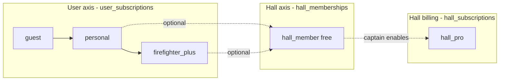

# Firefighter Plus — Architecture

**Date:** June 22, 2026  
**Role:** Product & platform architecture  
**Status:** Design only — no payment implementation  
**Depends on:** `review/personal-first-product.md`, `shared/billing/types.ts`, `server/billing/store.ts`

---

## Executive Summary

**Firefighter Plus** is an **individual, user-scoped subscription** for firefighters who want premium personal meal tools — planning, nutrition, offline access, and personal protein deals — without requiring a hall or Hall Pro.

| Layer | Scope | Price | Purpose |
|-------|-------|-------|---------|
| **Guest** | Device | Free | Cook tonight, no account |
| **Personal** | User | Free forever | Sync, basic saves, hall membership, solo Tonight |
| **Firefighter Plus** | User | Paid (see pricing) | Premium **personal** toolkit |
| **Hall membership** | User ↔ Hall link | **Free** | Collaboration: vote, shared list, meal history, staples |
| **Hall Pro** | Hall | Paid per hall | Premium **crew** coordination tools |

**Hall is not the product.** Hall membership stays free. Hall Pro stays a separate hall-scoped SKU. Firefighter Plus never substitutes for Hall Pro and never unlocks crew cloud features without a hall subscription.

---

## Product Positioning

```
┌─────────────────────────────────────────────────────────────────┐
│  PERSONAL (free) — "Your meals, your shift"                     │
│  Generator · Wheel · Browse · Sync · Limited saves · Join Hall  │
└───────────────────────────────┬─────────────────────────────────┘
                                │ Upgrade (individual)
                                ▼
┌─────────────────────────────────────────────────────────────────┐
│  FIREFIGHTER PLUS — "Your professional meal kit"                │
│  Unlimited planning & saves · Calendar · Nutrition · Offline    │
│  Personal protein deals · AI subs · Meal prep · Advanced search │
└───────────────────────────────┬─────────────────────────────────┘
                                │ Optional, orthogonal
                                ▼
┌─────────────────────────────────────────────────────────────────┐
│  HALL MEMBERSHIP (free) — collaboration link                    │
│  Hall Vote · Shared Shopping List · Hall Meal History · Staples │
└───────────────────────────────┬─────────────────────────────────┘
                                │ Captain enables (per hall)
                                ▼
┌─────────────────────────────────────────────────────────────────┐
│  HALL PRO — "Crew collaboration"                                │
│  Shared list · Meal history · Staples · Advanced vote · Grocery │
└─────────────────────────────────────────────────────────────────┘
```

**Who buys Plus?**

- Solo firefighters or members of halls without Pro budget
- Cooks who want nutrition, meal prep, and offline recipes on their phone
- Anyone who wants protein deals tied to **their** stores and **personal** grocery list

**Who buys Hall Pro?**

- Captains / canteen managers funding **crew-wide** tools from station budget
- Departments needing shared shopping runs, cloud hall history, staples management

A user can be **Plus + free hall member**, **Plus + Hall Pro member**, **Personal only**, or any combination. Billing axes do not collapse into one plan.

---

## Pricing Comparison

Public launch targets align with `review/growth-master-plan.md`. Firefighter Plus is new revenue on the **individual** axis; Hall Pro remains the **crew** revenue line.

| | **Guest** | **Personal** | **Firefighter Plus** | **Hall membership** | **Hall Pro** |
|---|:---:|:---:|:---:|:---:|:---:|
| **Price** | Free | Free | **$7.99/mo** or **$79/yr** | Free | **$29/mo** hall · **$19/mo** founding |
| **Billed to** | — | User | User | — | Hall (captain) |
| **Account required** | No | Yes | Yes | Yes | Hall + captain |
| | | | | | |
| **Cook tonight** | ✅ | ✅ | ✅ | ✅ | ✅ |
| **Classics wheel & browse** | ✅ | ✅ | ✅ | ✅ | ✅ |
| **Cross-device sync** | — | ✅ | ✅ | ✅ | ✅ |
| **Saved meals** | Local only | **25** | **Unlimited** | Uses personal quota | Uses personal quota |
| **Meal planning** | Session only | **3 active plans** | **Unlimited** | — | — |
| **Personal meal history** | — | **90 days** | **Unlimited** | — | — |
| **Meal calendar** | — | — | ✅ | — | — |
| **Advanced search** | Basic | Basic | ✅ | — | — |
| **Personal grocery exports** | — | Copy text | PDF · share sheet · formats | — | — |
| **Nutrition panel** | — | Summary only | Full macros + crew scaling | — | — |
| **Meal prep mode** | — | — | ✅ | — | — |
| **AI substitutions** | — | — | ✅ | — | — |
| **Offline recipes** | — | — | ✅ (saved + recent) | — | — |
| **Personal protein deals** | — | — | ✅ | — | — |
| **Shift reminders** | — | ✅ | ✅ | — | — |
| | | | | | |
| **Connect to Hall** | — | ✅ | ✅ | ✅ | ✅ |
| **Hall Vote** | — | ✅ | ✅ | ✅ | ✅ |
| **Shared Shopping List** | — | ✅ contribute | ✅ contribute | ✅ | ✅ cloud sync |
| **Hall Meal History** | — | ✅ view | ✅ view | ✅ | ✅ cloud log |
| **Hall Staples** | — | ✅ report | ✅ report | ✅ | ✅ manage |
| **Advanced Hall Vote** | — | Basic vote | Basic vote | Basic vote | ✅ |
| **Hall grocery planning** | — | — | — | — | ✅ |

**Positioning copy (for `/plans`):**

- **Personal:** *"Free forever — sync your meals and join your crew."*
- **Firefighter Plus:** *"Your shift meal kit — plan, prep, and shop like a pro."*
- **Hall Pro:** *"Crew collaboration — shared list, history, staples, advanced vote, and grocery planning."*

**Annual math:** Plus annual ($79) ≈ 2 months free. Hall Pro annual ($290 founding / $348 public) stays the procurement-friendly crew SKU.

---

## Feature Catalog

### Plus features (new `BillingFeature` keys)

| Feature key | User-facing name | Free Personal | Plus | Hall Pro |
|-------------|------------------|:-------------:|:----:|:--------:|
| `unlimited_meal_planning` | Unlimited meal planning | — | ✅ | — |
| `unlimited_saved_meals` | Unlimited saved meals | — | ✅ | — |
| `meal_calendar` | Meal calendar | — | ✅ | — |
| `advanced_search` | Advanced search | — | ✅ | — |
| `personal_protein_deals` | Protein Deals (personal) | — | ✅ | — |
| `personal_grocery_exports` | Personal grocery exports | — | ✅ | — |
| `nutrition` | Nutrition | — | ✅ | — |
| `meal_prep` | Meal prep | — | ✅ | — |
| `ai_substitutions` | AI substitutions | — | ✅ | — |
| `offline_recipes` | Offline recipes | — | ✅ | — |

### Free Personal limits (enforced via quotas, not feature flags)

| Quota key | Guest | Personal | Plus |
|-----------|-------|----------|------|
| `saved_meals_max` | 0 (local) | 25 | ∞ |
| `active_meal_plans_max` | 1 | 3 | ∞ |
| `meal_history_days` | 0 | 90 | ∞ |
| `grocery_export_tier` | none | `copy` | `full` |

Quotas live in a separate `BillingQuotas` object on `UserBillingState` so limits can be tuned without new feature flags.

### Hall Pro features (hall-scoped)

| Feature key | User-facing name | Hall Pro |
|-------------|------------------|:--------:|
| `shared_shopping_lists` | Shared Shopping List | ✅ |
| `hall_history` | Hall Meal History | ✅ |
| `canteen_management` | Hall Staples | ✅ |
| `advanced_hall_vote` | Advanced Hall Vote | ✅ |
| `hall_grocery_planning` | Hall grocery planning | ✅ |

**Not in Hall Pro:** `protein_deals` (deprecated) — crew deals use `hall_grocery_planning`; personal deals use `personal_protein_deals` (Plus).

### Protein Deals — dual scope

Today `protein_deals` is Hall Pro only. Architecture splits intent without breaking the hall route:

| Scope | Feature flag | Data key | UI route |
|-------|--------------|----------|----------|
| Personal | `personal_protein_deals` | User postal + personal store prefs | `/me/deals` or `/explore/deals` |
| Crew | `protein_deals` | Hall postal + hall store prefs | `/hall/protein-deals` |

Plus users get personal deals even with zero linked halls. Hall Pro adds crew-matched deals and "Add to shared shopping list." If a user has both Plus and Hall Pro, show both surfaces; do not merge billing checks.

### What stays free on Personal (unchanged philosophy)

- Sign-in, sync, join/create hall
- Generator, wheel, browse, cook mode
- Participate in Hall Vote, contribute to shared list, view hall meal history, report staples
- Shift reminders
- Basic search and copy-to-clipboard grocery list

**Deliberate trim for upgrade path:** remove unlimited `grocery_exports` from free Personal in `PLAN_BASE_FEATURES` when Plus ships; free tier gets `grocery_exports: false` with a `copy_list` capability outside billing.

---

## Billing Model (Three-Axis)



### Plan ID change

```typescript
// shared/billing/types.ts (target)
export const USER_PLAN_IDS = ["guest", "personal", "firefighter_plus"] as const;
export const HALL_PLAN_IDS = ["hall_pro"] as const;
export const PLAN_IDS = [...USER_PLAN_IDS, ...HALL_PLAN_IDS] as const;
```

`UserBillingState.plan_id` and `effective_plan_id` use **user plans only** (`guest` | `personal` | `firefighter_plus`). `hall_pro` never appears on `user_subscriptions` (fixes today's legacy normalization hack).

### Tier rank

```typescript
export function planTierRank(planId: UserPlanId): number {
  switch (planId) {
    case "guest": return 0;
    case "personal": return 1;
    case "firefighter_plus": return 2;
  }
}
```

`hall_pro` is **not ranked** on the user axis — use `hallHasPro(hallId)` separately.

### Feature resolution (server)

```typescript
function userHasFeature(userId: string, feature: BillingFeature, hallId?: string): boolean {
  const billing = resolveUserBilling(userId);

  if (isHallProFeature(feature)) {
    return hallId != null && billing.hall_pro_hall_ids.includes(hallId);
  }

  if (isPlusFeature(feature)) {
    return billing.effective_plan_id === "firefighter_plus"
      && hasFeature(billing.features, feature);
  }

  return hasFeature(billing.features, feature);
}
```

### Client hooks (target)

| Hook | Use |
|------|-----|
| `useFeature(feature)` | User-scoped features (Plus, Personal) |
| `useHallFeature(feature, hallId?)` | Hall Pro features only |
| `useQuota(quotaKey)` | Saved meals count, plan limits |
| `usePlanId()` | `guest` \| `personal` \| `firefighter_plus` |
| `useHallHasPro(hallId?)` | Hall Pro on linked hall |

Remove `authCapabilities` fallbacks that auto-grant `cross_device_saves` when `authenticated` — capabilities must derive from `billing.features` and quotas only, or Plus paywalls are bypassed.

---

## Data Model

### Migration `017_firefighter_plus.sql` (architecture — not applied)

```sql
-- New user tier in catalog
INSERT OR IGNORE INTO plan_catalog
  (plan_id, display_name, tagline, price_label, enabled, sort_order)
VALUES
  ('firefighter_plus', 'Firefighter Plus', 'Your professional shift meal kit', '$7.99/mo', 0, 2);

-- Re-sort: guest 0, personal 1, firefighter_plus 2, hall_pro 3
UPDATE plan_catalog SET sort_order = 3 WHERE plan_id = 'hall_pro';

-- Seed Plus feature flags (enabled=0 until launch flag)
-- unlimited_meal_planning, unlimited_saved_meals, meal_calendar, ...

-- Optional: quota overrides per plan (new table)
CREATE TABLE IF NOT EXISTS plan_quotas (
  plan_id TEXT NOT NULL,
  quota_key TEXT NOT NULL,
  limit_value INTEGER,  -- NULL = unlimited
  PRIMARY KEY (plan_id, quota_key)
);

INSERT OR IGNORE INTO plan_quotas (plan_id, quota_key, limit_value) VALUES
  ('personal', 'saved_meals_max', 25),
  ('personal', 'active_meal_plans_max', 3),
  ('personal', 'meal_history_days', 90),
  ('firefighter_plus', 'saved_meals_max', NULL),
  ('firefighter_plus', 'active_meal_plans_max', NULL),
  ('firefighter_plus', 'meal_history_days', NULL);

-- Future payment fields (schema only, no Stripe)
ALTER TABLE user_subscriptions ADD COLUMN stripe_customer_id TEXT;
ALTER TABLE user_subscriptions ADD COLUMN stripe_subscription_id TEXT;
ALTER TABLE user_subscriptions ADD COLUMN billing_interval TEXT CHECK (billing_interval IN ('month', 'year'));
```

### `UserBillingState` extension

```typescript
export interface BillingQuotas {
  saved_meals_max: number | null;
  active_meal_plans_max: number | null;
  meal_history_days: number | null;
  grocery_export_tier: "none" | "copy" | "full";
}

export interface UserBillingState {
  plan_id: UserPlanId;
  effective_plan_id: UserPlanId;
  features: Record<BillingFeature, boolean>;
  quotas: BillingQuotas;
  usage: {
    saved_meals_count: number;
    active_meal_plans_count: number;
  };
  hall_pro_hall_ids: string[];
  // ...
}
```

### Sync & offline data (Plus)

| Data | Free Personal | Plus |
|------|---------------|------|
| Saved recipes | Cloud sync, capped | Cloud sync, unlimited + **local cache** |
| Meal plans | Cloud, capped | Cloud, unlimited |
| Offline cache | — | Service worker precache of saved + last 20 cooked |
| Calendar events | — | `personal_meal_calendar` sync key |

New sync keys in `shared/sync/types.ts`:

- `personal_meal_plans`
- `personal_meal_calendar`
- `offline_recipe_manifest` (client-local, optional server index)

---

## API Surface (no payments)

### Existing routes (extend)

| Route | Change |
|-------|--------|
| `GET /api/billing/plans` | Include `firefighter_plus` in catalog |
| `GET /api/billing/me` | Return `quotas`, `usage`, Plus features |
| `POST /api/billing/select-plan` | Accept `personal` \| `firefighter_plus` (admin/preview grant only until Stripe) |
| `PATCH /api/admin/billing/users/:userId` | Grant `firefighter_plus` |

### New routes (feature enforcement)

| Route | Gate |
|-------|------|
| `GET/POST /api/me/meal-plans` | Quota / `unlimited_meal_planning` |
| `GET/POST /api/me/meal-calendar` | `meal_calendar` |
| `GET /api/me/protein-deals` | `personal_protein_deals` |
| `POST /api/me/grocery-export` | `personal_grocery_exports` |
| `POST /api/recipes/:slug/substitutions` | `ai_substitutions` |
| `GET /api/recipes/:slug/nutrition` | `nutrition` (full); partial free |

### Hall routes (unchanged gates)

- `server/grocery-deals/routes.ts` → `protein_deals` + `hallId`
- `server/hall-shopping-list/routes.ts` → `shared_shopping_lists`
- `server/hall-canteen/routes.ts` → `canteen_management`

---

## UI & Paywall Surfaces

### `/plans` — comparison layout

Three columns for individuals + separate Hall Pro card:

1. **Personal** (current plan / free)
2. **Firefighter Plus** (upgrade CTA — disabled checkout until `payments_enabled`)
3. **Hall Pro** (link to linked hall settings if member; "Connect to Hall" if not)

Reuse `PlanCard`; add `PlanComparisonTable` component driven by `PLAN_COMPARISON` constant in `shared/billing/plan-comparison.ts` (single source for marketing + tests).

### PaywallGate placements (Plus)

| Surface | Feature / quota | Fallback copy |
|---------|-----------------|---------------|
| Save recipe button | `unlimited_saved_meals` / quota | "Save up to 25 meals on Personal" |
| Me → Calendar | `meal_calendar` | "Plan your month with Plus" |
| Explore filters | `advanced_search` | "Filter by protein, time, macros with Plus" |
| Recipe → Nutrition | `nutrition` | Blur macros; show calories only |
| Recipe → Substitute | `ai_substitutions` | "Swap ingredients with Plus" |
| Me → Deals | `personal_protein_deals` | "Deals near your station" |
| Grocery export modal | `personal_grocery_exports` | "Export PDF with Plus" |
| Meal prep toggle | `meal_prep` | "Batch and leftover planning" |
| Offline badge | `offline_recipes` | "Download for station dead zones" |

Hall Pro paywalls **stay on hall routes** — never show Hall Pro CTA on personal Plus surfaces.

### Copy rules

- Plus: **"Your"** / **"personal"** / **"shift kit"**
- Hall Pro: **"crew"** / **"linked hall"** / **"canteen"**
- Never: "Upgrade your hall" on Plus paywalls

---

## Feature Definitions (product spec)

### Unlimited meal planning

- **Free:** 3 active meal plans (Tonight pick + 2 saved plans)
- **Plus:** Unlimited named plans, duplicate week, assign to calendar
- **Storage:** `personal_meal_plans` sync key; server counts active plans for quota

### Unlimited saved meals

- **Free:** 25 cloud saves (Me → Saved Meals)
- **Plus:** No cap; same store as today `personal_favorites` / hall favorites split already done in personal-first refactor

### Meal calendar

- Month/week view of planned and cooked meals
- Drag plan to date; optional shift reminder integration
- Does **not** sync to hall — personal calendar only

### Advanced search

- Explore filters: max time, protein, dietary, nutrition range, meal prep tag, crew size default
- Free: text search + category rails only

### Personal protein deals

- User postal code + store prefs (reuse `grocery_preferences` scoped to `user_id`, not `hall_id`)
- Match deals to saved meals and Tonight pick
- Add to **personal** shopping list only

### Personal grocery exports

- **Free:** Copy ingredients to clipboard
- **Plus:** PDF, share sheet, structured export (Instacart-style text), crew scaling baked in

### Nutrition

- Full macro panel on recipe page + cook mode summary
- **Free:** Calories + protein headline only (data already in catalog)
- Crew-scaled totals in cook mode

### Meal prep

- Leftover quality hints, batch multiplier, "cook once / eat twice" prompts
- Links to `meal_prep` taxonomy tag in catalog

### AI substitutions

- Ingredient swap suggestions (allergy, missing item, healthier)
- Server route calls existing generation infra with constrained prompt; rate-limited per Plus user

### Offline recipes

- PWA: precache saved recipes + last N cooked
- `offline_recipes` feature enables manifest write; service worker already exists from build
- Show offline badge on recipe cards when cached

---

## Analytics Events (architecture)

| Event | When |
|-------|------|
| `plus_paywall_viewed` | Plus gate shown |
| `plus_trial_started` | Future — when payments live |
| `plus_converted` | Future |
| `quota_limit_hit` | Save/plan blocked on free |
| `plan_selected` | Extend `plan_id` enum with `firefighter_plus` |

Keep Hall Pro events separate (`hall_pro_trial_started`, etc.).

---

## Global Flags

| Flag | Launch state | Purpose |
|------|--------------|---------|
| `monetization_enabled` | on | Show `/plans` |
| `payments_enabled` | **off** | Stripe checkout — architecture only |
| `firefighter_plus_enabled` | **off** | Show Plus tier and gates (preview via admin grant) |
| `plus_preview_grants` | on | Admin can grant Plus without payment |

---

## Implementation Phases

### Phase 1 — Schema & resolution (no UI paywalls)

1. Add `firefighter_plus` to `PLAN_IDS`, `PLAN_DISPLAY`, `PLAN_BASE_FEATURES`
2. Add new `BillingFeature` keys + `PLUS_FEATURES` const
3. Migration `017_firefighter_plus.sql` — catalog row, feature seeds, `plan_quotas`
4. Extend `resolveUserBilling()` with quotas + usage counts
5. Split `personal_protein_deals` from hall `protein_deals` in types
6. Update `scripts/test-billing.ts` and add `scripts/test-firefighter-plus.ts`

### Phase 2 — Enforcement

1. Remove `authCapabilities` auth fallbacks for gated features
2. Server quota checks on save, meal plan create, export
3. `useQuota()` hook + extend `PaywallGate` for quota-based gates
4. Trim `grocery_exports` from free Personal feature map

### Phase 3 — Product surfaces

1. `/plans` comparison table (three user tiers + Hall Pro card)
2. Me → Calendar, Me → Deals routes
3. Explore advanced filters
4. Nutrition / substitutions / meal prep UI behind gates
5. Offline manifest + SW integration

### Phase 4 — Payments (out of scope for this doc)

1. Stripe Checkout for `firefighter_plus` monthly/annual
2. Webhook → `user_subscriptions.status`
3. Enable `payments_enabled` + `firefighter_plus_enabled`
4. Founding promos stay Hall Pro only unless product decides bundle

---

## Open Decisions

| # | Question | Recommendation |
|---|----------|----------------|
| 1 | Can Hall Pro halls get protein deals without Plus? | **Yes** — crew deals are Hall Pro; personal deals are Plus. Different routes. |
| 2 | Do Plus subscribers get more hall collaboration? | **No** — hall membership stays free and unchanged. |
| 3 | Lifetime Plus SKU? | Defer; Hall lifetime ($499) is hall-scoped. Optional Plus annual only at launch. |
| 4 | Department bulk Plus licenses? | Phase 4+ B2B; not launch scope. |
| 5 | Rename `personal` display name? | Keep **Personal** free; Plus is the paid individual brand. |
| 6 | Student / volunteer discount? | Marketing later; single price in architecture. |

---

## Files to Touch (implementation checklist)

| Area | Files |
|------|-------|
| Types | `shared/billing/types.ts`, `shared/billing/schema.ts`, `shared/billing/plan-comparison.ts` (new) |
| DB | `server/db/migrations/017_firefighter_plus.sql` (new) |
| Resolution | `server/billing/store.ts` |
| Routes | `server/billing/routes.ts`, new `server/me/*` routers |
| Auth | `shared/auth/types.ts` (`authCapabilities`) |
| Client hooks | `client/src/lib/billing/hooks.ts`, `constants.ts` |
| UI | `client/src/pages/plans-page.tsx`, `plan-card.tsx`, `paywall-gate.tsx` |
| Tests | `scripts/test-billing.ts`, `scripts/test-firefighter-plus.ts` (new) |
| Docs | Update `review/growth-master-plan.md` revenue section when approved |

---

## Summary

Firefighter Plus adds a **paid individual axis** without conflating hall membership (free) or Hall Pro (crew). Feature flags, quotas, and dual-scoped protein deals keep the three layers orthogonal. Payment plumbing is schema-ready but explicitly **not implemented** — admin grants and `firefighter_plus_enabled` flag control preview access until Stripe ships.
