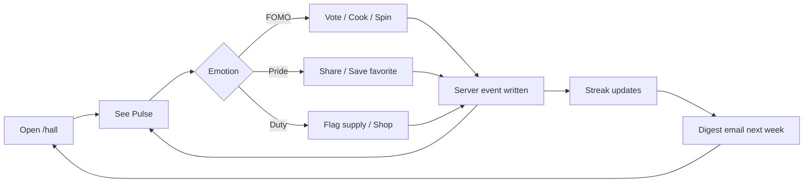

# Hall Activity Feed — V1 Design

**Date:** June 22, 2026  
**Goal:** Make halls feel **alive** — crews should open `/hall` and immediately sense momentum: who cooked, what won, what’s running low, and whether their shift is on a streak.  
**North Star tie-in:** Halls with **≥1 hall-visible activity per shift week** for **4 consecutive weeks** (`firehall-meals-90-roadmap.md`).  
**Companion:** `navigation-v3.md`, `hall-pro-audit.md`, `performance-audit-v3.md`, `firefighter-user-journeys.md`

---

## Executive summary

Hall Activity exists today as a **merged feed** (local history + favorites + supply shortages + sparse server events) with a dashboard teaser and orphan full page at `/hall/activity`. It reads like a **personal device log dressed as social** — shift label appears twice on every card, no member names, and crew-wide events only appear after a captain opens Hall Pro analytics sync.

**V1 repositions activity as “Crew Pulse”** — the heartbeat of the hall, not a buried teaser above quick actions.

| Pillar | V1 decision |
|--------|-------------|
| **Events** | 8 feed actions; server write on every cook/vote/wheel/shop — not Pro-gated |
| **Cards** | Actor-first copy (“Mike · B Shift cooked **Big Chili**”) + optional recipe thumb |
| **Notifications** | Weekly digest email + optional shift-day nudge; no push in V1 |
| **Badges** | Shift letter badges + streak flame only; **no** achievement badge system |
| **Hall streaks** | Promoted into Pulse header; server-backed when events exist |
| **Retention loops** | See → react → contribute → streak protect → return next shift |

**Product stance:** Activity feed is **free for all hall members**. Hall Pro adds analytics depth (trends, exports) — not the feed itself.

---

## Problem statement

### What crews feel today

| Symptom | Root cause |
|---------|------------|
| “Is anyone else using this?” | Server feed empty unless Pro sync runs |
| “Why does it say B Shift twice?” | Card copy: `{shiftLabel} {action}:` then subject |
| “I didn’t know they voted” | No notifications; feed not on Tonight path |
| “My streak doesn’t count for the hall” | Streaks computed from local history only |
| “Activity is buried” | Teaser above actions; no tab/nav entry |

### What “alive” means (design test)

A probie opens the hall on Tuesday night and within **3 seconds** can answer:

1. **What happened since I was last here?** (feed)
2. **Is my shift winning this month?** (leaderboard snippet)
3. **Are we on a streak?** (pulse header)
4. **What should I do next?** (CTA tied to latest event type)

---

## Current state (implemented)

| Layer | Status | Key files |
|-------|--------|-----------|
| Feed types | 6 actions: `cooked`, `voted`, `saved`, `added`, `spun`, `shopped` | `shared/hall-activity/types.ts` |
| Server events | 4 types in SQLite | `shared/hall-analytics/types.ts`, migration `021_hall_analytics.sql` |
| Merge builder | Local + server, dedup, limit 40 | `shared/hall-activity/feed.ts` |
| API | `GET /api/halls/:hallId/activity-feed` | `server/hall-analytics/routes.ts` |
| UI | Teaser (2 items), full page, feed card | `client/src/components/hall-activity/*` |
| Streaks | Local calendar-day consecutive counts | `shared/hall-streak/compute.ts` |
| Leaderboard | Parallel merge from same events | `shared/hall-leaderboard/*` |

**Permission:** `view_hall_dashboard` — all hall roles; guests see local-only feed.

---

## V1 information architecture

### Surfaces

```
┌─────────────────────────────────────────┐
│  /hall  —  Crew Pulse (primary)         │
│  ┌───────────────────────────────────┐  │
│  │ Pulse header: streak + “this week” │  │
│  ├───────────────────────────────────┤  │
│  │ Quick actions (vote, wheel, gen)   │  │  ← actions FIRST (mobile audit)
│  ├───────────────────────────────────┤  │
│  │ Activity stream (5 items, expand)  │  │
│  │ Leaderboard snippet (top shift)    │  │
│  └───────────────────────────────────┘  │
│                                         │
│  /hall/activity  —  full feed + filters │
│  /hall/leaderboard  —  unchanged        │
└─────────────────────────────────────────┘
```

### Naming

| Internal | User-facing |
|----------|-------------|
| `HallActivityTeaser` | **Crew Pulse** (section title) |
| `Hall Activity` page | **Crew Pulse** or “All activity” |
| `hall_activity_events` | unchanged (server table) |

Copy update in `brand-copy.ts`:

```ts
HALL_ACTIVITY = {
  title: "Crew Pulse",
  subtitle: "What your hall did lately — meals, votes, and supply runs.",
  empty: "Quiet shift. Cook something, spin the wheel, or start a vote to get the hall moving.",
  viewAll: "See all",
  backToHall: "Back to hall",
}
```

### Navigation v3 alignment

- **Hall tab** default landing shows Crew Pulse inline (expandable).
- `/hall/activity` remains for deep scroll + filters — linked from “See all”.
- Remove orphan feel: Pulse is never the only link to a dead-end page.

---

## Events

### Event taxonomy

V1 uses a **two-layer model** (unchanged pattern, expanded coverage):

| Layer | Purpose | Storage |
|-------|---------|---------|
| **Server `HallActivityType`** | Source of truth for crew-wide feed | `hall_activity_events` |
| **Feed `HallActivityFeedAction`** | Presentation verb on cards | Built at read time |

### Server event types (V1)

| `HallActivityType` | Feed action | Trigger | `external_id` |
|--------------------|-------------|---------|---------------|
| `meal_cooked` | `cooked` | Cook Mode complete / “Mark cooked” on recipe | `history_entry_id` or `recipe_slug:date` |
| `vote_created` | `voted` | Captain creates hall vote | `vote_id` |
| `wheel_spin` | `spun` | Wheel lands on a classic | `spin_id` or `slug:timestamp` |
| `shopping_list_completed` | `shopped` | Shared list marked done | `list_id:completion_ts` |
| **`vote_cast`** *(new)* | `voted` | Member submits vote | `vote_id:user_id` |
| **`member_joined`** *(new)* | `joined` | User accepts hall invite | `user_id` |
| **`supply_flagged`** *(new)* | `added` | Canteen/supply → low or out | `supply_id:status` |
| **`favorite_saved`** *(new)* | `saved` | Hall favorite added (shared) | `slug:user_id:ts` |

**Deferred to V1.1+:** `meal_generated`, `canteen_report`, `deal_matched`, `invite_sent`, `shift_report`.

### Write path (critical V1 fix)

Today server events are written when:

- Shopping list completed (server)
- Hall Pro analytics sync (client batch — **wrong for social feed**)

**V1 rule:** Write server event **at action time** via API — membership required, not Pro.

```
Cook complete  → POST /api/halls/:id/activity-events  (or inline in cook endpoint)
Vote created   → existing vote route + upsertHallActivity
Vote cast      → vote submit route + upsertHallActivity
Wheel spin     → wheel result route + upsertHallActivity
Favorite saved → favorites API + upsertHallActivity (if hall member)
Supply flagged → supplies API + upsertHallActivity
```

Local history remains for:

- Repeat cooldown / personal log (`/hall-history`)
- Offline queue → sync on reconnect (best-effort)

### Dedup strategy

Replace naive `action|subject|at` key with:

```
dedup_key = event_type + ":" + external_id
```

Server events **win** over local history when both exist. Client merge in `buildHallActivityFeed` already prefers server-first ordering — extend dedup to use `external_id` mapping from history meta.

### Event payload (extended)

```ts
interface HallActivityEvent {
  activity_id: string;
  hall_id: string;
  user_id: string | null;
  user_display_name: string | null;   // NEW — denormalized at write
  event_type: HallActivityType;
  external_id: string;
  title: string;
  recipe_slug: string | null;
  cuisine: string | null;
  category: string | null;
  shift_label: string | null;
  shift_key: HallShiftKey | null;   // NEW — optional, server-set
  occurred_at: string;
  metadata_json?: string;             // NEW — vote option, crew_size, etc.
}
```

Migration: `031_hall_activity_v1.sql` — add columns `user_display_name`, `shift_key`, `metadata_json`; extend `event_type` CHECK if needed.

---

## Cards

### Card anatomy (V1)

```
┌──────────────────────────────────────────────────┐
│ [thumb?]  [A]  Mike · A Shift          2h ago    │
│               cooked                             │
│               Big Chili                          │
│               └ link to recipe / vote            │
└──────────────────────────────────────────────────┘
```

| Element | Rule |
|---------|------|
| **Avatar** | Shift letter badge (keep `shiftBadgeLetter`) — color per A/B/C/D |
| **Actor line** | `{displayName} · {shiftLabel}` — fallback “A crew member” if anonymous |
| **Action verb** | Past tense, lowercase: cooked, voted for, saved, flagged, spun, shopped |
| **Subject** | Meal title, vote question, supply name — `font-semibold`, max 2 lines |
| **Thumb** | 40×40 WebP for `cooked` / `saved` / `spun` when `recipe_slug` present |
| **Timestamp** | Relative ≤7d, else short date (`formatActivityTimestamp` — keep) |
| **Tap** | Whole card → `href` (recipe, vote, supplies) |

### Copy templates

| Action | Template |
|--------|----------|
| `cooked` | `{actor} cooked **{title}**` |
| `voted` | `{actor} voted for **{option}**` (vote_cast) or `{actor} started a vote: **{title}**` (vote_created) |
| `saved` | `{actor} saved **{title}** to hall favorites` |
| `added` | `{actor} flagged **{supply}** as {low\|out}` |
| `spun` | `{actor} spun the wheel → **{title}**` |
| `shopped` | `{actor} finished the hall shopping list` |
| `joined` | `{actor} joined the hall` |

**Remove** duplicate shift label in body (“B Shift cooked:” where header already shows B Shift).

### Card variants

| Variant | Where | Items |
|---------|-------|-------|
| **Compact** | Pulse on `/hall` | 5 rows, no thumb |
| **Standard** | `/hall/activity` | Thumb when available |
| **Highlight** | Streak milestone, first cook of week | Primary border + “This week” chip |

### Empty / loading / error

| State | UX |
|-------|-----|
| Loading | 3 skeleton rows |
| Empty (member) | Illustration + “Start a vote” / “Spin wheel” CTAs |
| Empty (guest) | “Join your hall to see crew activity” |
| Error | Retry + show local-only feed fallback |

### Component changes

| File | Change |
|------|--------|
| `hall-activity-feed-card.tsx` | Actor line, copy templates, optional thumb |
| `shared/hall-activity/types.ts` | Add `actorName?`, `actorUserId?`, `thumbUrl?` to `HallActivityFeedItem` |
| `shared/hall-activity/feed.ts` | Map `user_display_name` from server events |

---

## Notifications

V1 does **not** add mobile push. Leverage existing **shift reminder email** infrastructure.

### Channels

| Channel | V1 | Notes |
|---------|-----|-------|
| In-app Pulse | Yes | Primary — no permission needed |
| Email digest | Yes | Weekly “Hall pulse” summary |
| Shift-day email | Optional opt-in | Extends shift reminders |
| Push / SMS | No | V1.2+ |
| In-app toast | No | Too noisy for firehall context |

### Notification types

| Type | Trigger | Audience | Content |
|------|---------|----------|---------|
| **Weekly digest** | Sunday 6pm local | Members with `hall_digest_enabled` | Top 3 events, streak status, leaderboard leader |
| **Vote needs you** | Vote created + <50% participation after 4h | Members who haven’t voted | “A Shift started dinner vote — cast yours” |
| **Streak at risk** | No hall `meal_cooked` in 6 days, streak ≥2 | All members | “3-week streak — cook this shift to keep it” |
| **New member** | `member_joined` | Captains only | “{name} joined — assign shift?” |

### Settings (account page)

Extend shift reminder settings panel:

```
☑ Weekly hall digest (email)
☑ Remind me when my hall starts a vote
☐ Streak protection reminders
```

Store in `user_preferences` JSON or new columns — default digest **on** for hall members.

### Deep links

All emails link to `/hall` with query `?pulse=1` or directly to vote `/vote/:id`.

---

## Badges

### In scope for V1

| Badge | Meaning | Where |
|-------|---------|-------|
| **Shift letter** (A/B/C/D) | Crew assignment | Card avatar, leaderboard rows |
| **Streak flame** | `current >= 2` consecutive days | Pulse header, streak rows |
| **“This week” chip** | Event occurred in current ISO week | Highlight cards |
| **Captain dot** | Role indicator on actor name | Optional — captains only in metadata |

### Explicitly out of scope (V1)

Per `hall-pro-audit.md` — **ghost Pro feature**:

- Achievement badges (“First chili”, “10 cooks”)
- Custom hall badge upload
- Badge showcase on profile

**Rationale:** Retention proof before gamification inventory. Shift color + streak flame deliver “alive” without new asset pipeline.

---

## Hall streaks

### V1 integration with Pulse

Move streak **summary** into Pulse header (collapse full `HallStreaksPanel` below fold on mobile).

```
┌─────────────────────────────────────────┐
│ 🔥 3-week meal streak · Hall            │
│ Your shift (B): 2 weeks · Wheel: 1 week │
│ [View streaks]                          │
└─────────────────────────────────────────┘
```

### Data source priority

| Scope | V1 source | Fallback |
|-------|-----------|----------|
| Hall meals streak | Server `hall_activity_events` (`meal_cooked`) when ≥5 events in 30d | Local history |
| Shift meals streak | Server events filtered by `shift_label` | Local history |
| Wheel streak | Existing `wheel_streak` store + server `wheel_spin` | Local |

Compute function: `buildHallStreaksFromEvents(events, wheelSnapshot)` in `shared/hall-streak/compute.ts` — add alongside existing history path; dashboard uses best available.

### Streak rules (document for crews)

| Kind | Counts when | Resets when |
|------|-------------|-------------|
| Meals | Hall logs `meal_cooked` on consecutive **calendar days** (hall timezone) | 48h gap with no cook |
| Votes | `vote_cast` or `vote_created` per day | 48h gap |
| Wheel | `wheel_spin` per day | 48h gap |

**Note:** “Shift in a row” copy is **days with activity**, not rotation cycles — keep honest labeling: “3 days in a row” not “3 shifts in a row” unless tied to shift schedule (V1.1).

### Streak moments in feed

Insert synthetic **highlight** items (not stored):

- `🔥 Hall hit a 3-week cooking streak`
- `🏆 B Shift takes the monthly lead`

Generated client-side when streak thresholds cross — max 1 highlight per Pulse load.

---

## Retention loops

### Loop map



### Loop 1 — Social proof (“they’re using it”)

| Step | Mechanism |
|------|-----------|
| Trigger | Member completes cook |
| Reward | Event appears in Pulse within 30s (poll or optimistic UI) |
| Investment | Actor name visible to hall |
| Return | Other members see activity on next `/hall` visit |

**Metric:** `hall_activity_events` per hall per week ≥ 3.

### Loop 2 — Competition (“our shift is winning”)

| Step | Mechanism |
|------|-----------|
| Trigger | Leaderboard snippet in Pulse |
| Reward | Shift name in top slot |
| Investment | Cook/vote to add points |
| Return | Monthly reset creates fresh race |

**Metric:** `hall_leaderboard_viewed` + correlated `meal_cooked` within 24h.

### Loop 3 — Streak protection

| Step | Mechanism |
|------|-----------|
| Trigger | Streak ≥2, no cook in 5 days |
| Reward | Streak digest + in-app flame emphasis |
| Investment | One cook to extend |
| Return | Loss aversion on break |

**Metric:** `hall_streak_updated` with `current >= 3` cohort retention.

### Loop 4 — Vote closure

| Step | Mechanism |
|------|-----------|
| Trigger | Captain starts vote |
| Reward | “Needs you” email to non-voters |
| Investment | Single tap vote |
| Return | Result appears in Pulse → cook winner |

**Metric:** Votes with ≥60% member participation.

### Loop 5 — Onboarding spark

| Step | Mechanism |
|------|-----------|
| Trigger | `member_joined` |
| Reward | Captain notified; join event in Pulse |
| Investment | Captain assigns shift |
| Return | New member sees shift badge on first action |

**Metric:** Join → first `meal_cooked` or `vote_cast` within 7 days.

### Anti-patterns to avoid

- Notification on every cook (noise)
- Showing empty Pulse above actions (current layout)
- Pro-gating the feed (kills social proof)
- Fake activity / demo events in production halls

---

## API & data model summary

### New / changed endpoints

| Method | Path | Purpose |
|--------|------|---------|
| `POST` | `/api/halls/:hallId/activity-events` | Single event write (member) |
| `GET` | `/api/halls/:hallId/activity-feed` | Add `?cursor=&limit=&shift=&action=` |
| `GET` | `/api/halls/:hallId/pulse` | **Optional** — feed + streak summary + leaderboard snippet in one round-trip |

### Pulse endpoint response (recommended)

```ts
interface HallPulsePayload {
  hall_id: string;
  generated_at: string;
  streak: HallStreaksSnapshot;
  leaderboard_snippet: {
    month_label: string;
    top_shift: string | null;
    my_shift_rank: number | null;
  };
  items: HallActivityFeedItem[];
  has_more: boolean;
  cursor: string | null;
}
```

Reduces dashboard waterfall: feed + supplies + streaks currently = 3+ client calls.

### Pagination

- Default limit: 20 (full page), 5 (Pulse)
- Cursor: `occurred_at` + `activity_id`
- Server: `listHallActivityEvents` — add `WHERE occurred_at < ?` instead of load-all-then-slice

---

## UI implementation plan

### Phase A — Feel alive (week 1)

| Task | Owner |
|------|-------|
| Server write on cook/vote/wheel | Backend |
| Actor name on cards | Frontend |
| Reorder dashboard: actions → Pulse | Frontend |
| Rename to Crew Pulse | Copy |
| Optimistic local event + server confirm | Frontend |

### Phase B — Crew-wide truth (week 2)

| Task | Owner |
|------|-------|
| Migration `031_hall_activity_v1` | Backend |
| `vote_cast`, `member_joined`, `supply_flagged` events | Backend |
| Dedup by `external_id` | Shared |
| `/hall/pulse` combined endpoint | Backend |
| Pulse header streak summary | Frontend |

### Phase C — Return loops (week 3)

| Task | Owner |
|------|-------|
| Weekly digest email template | Backend |
| Vote reminder job | Backend |
| Account notification toggles | Frontend |
| Streak-at-risk email | Backend |
| Analytics: `hall_activity_item_clicked`, `hall_pulse_expanded` | Full stack |

### Dashboard layout (V1 target)

```
1. HallDashboardHeader
2. HallDashboardActions          ← moved up
3. Crew Pulse (5 items + expand)  ← was teaser at top
4. HallStatsGrid
5. HallTonightsMealCard
6. … rest unchanged …
7. HallStreaksPanel (collapsed)   ← optional accordion
```

---

## Analytics

### New events

| Event | Metadata |
|-------|----------|
| `hall_pulse_viewed` | `item_count`, `has_streak`, `hall_id` |
| `hall_pulse_expanded` | `from_teaser: boolean` |
| `hall_activity_item_clicked` | `action`, `recipe_slug`, `position` |
| `hall_activity_event_written` | `event_type`, `source: server\|sync` |
| `hall_digest_sent` | `hall_id`, `recipient_count` |
| `hall_vote_reminder_sent` | `vote_id`, `recipient_count` |

### North Star dashboard fields

| Metric | Definition |
|--------|------------|
| Active halls / week | Halls with ≥1 server `hall_activity_events` row |
| Pulse engagement | Members with `hall_pulse_viewed` / active members |
| 4-week retention | Cohort joined hall → still active week 4 |
| Events per hall | P50 / P90 weekly event count |

---

## Permissions & privacy

| Rule | Detail |
|------|--------|
| View Pulse | `view_hall_dashboard` — all members |
| Write events | Authenticated hall member only |
| Actor name | Display name from profile; fallback first name + last initial |
| Guest mode | Local device events only; label “You” |
| Captain analytics | Unchanged — Hall Pro for trends at `/hall/settings` |

**Opt-out:** Users can set “Show my name on hall activity” (default on) in account privacy — when off, show “A crew member · B Shift”.

---

## Out of scope (V1)

- Real-time WebSocket feed
- Push notifications
- Achievement badge system (`hall_badges`)
- Comments / reactions on feed items
- Cross-hall regional feed
- AI-generated activity summaries
- `meal_generated` in feed (too noisy)

---

## Success criteria

| Criteria | Target (90 days post-ship) |
|----------|----------------------------|
| Server events per active hall / week | ≥5 median |
| Halls with ≥1 event / week | 70% of halls with ≥3 members |
| Pulse section seen on `/hall` | 80% of hall sessions |
| 4-week hall retention | 40% (roadmap milestone) |
| Duplicate card reports | <1% of feed items |

---

## Open questions

1. **Timezone for streaks** — hall setting vs user setting? Recommend hall timezone from `hall_settings`.
2. **Vote visibility** — show live tallies in feed or only “voted for X”? Recommend option name only until vote closes.
3. **Favorites in feed** — saved meals are personal today; V1 shared favorites event only when saved to **hall** favorites (already separate store).
4. **Digest day** — Sunday vs “day before your shift”? Start Sunday; personalize in V1.1.
5. **Pulse vs Activity route** — merge into one route with hash `#pulse` or keep both? Recommend keep both; Pulse is inline, `/hall/activity` is full history.

---

## File touch list (implementation reference)

| Area | Files |
|------|-------|
| Types | `shared/hall-activity/types.ts`, `shared/hall-analytics/types.ts` |
| Feed builder | `shared/hall-activity/feed.ts` |
| Streaks | `shared/hall-streak/compute.ts` |
| Store | `server/hall-analytics/store.ts` |
| Routes | `server/hall-analytics/routes.ts`, cook/vote/wheel routes |
| Migration | `server/db/migrations/031_hall_activity_v1.sql` |
| Hook | `client/src/hooks/use-hall-activity-feed.ts` → `useHallPulse` |
| UI | `hall-activity-feed-card.tsx`, `hall-activity-teaser.tsx` → `crew-pulse.tsx` |
| Dashboard | `hall-dashboard-v2.tsx` |
| Copy | `client/src/lib/brand-copy.ts` |
| Email | `server/shift-reminder/` or new `server/hall-digest/` |
| Tests | `scripts/test-hall-activity.ts` (extend) |

---

*Design only — no implementation in this pass. Ship Phase A first; crew-wide server writes are the highest-leverage change for “alive.”*
