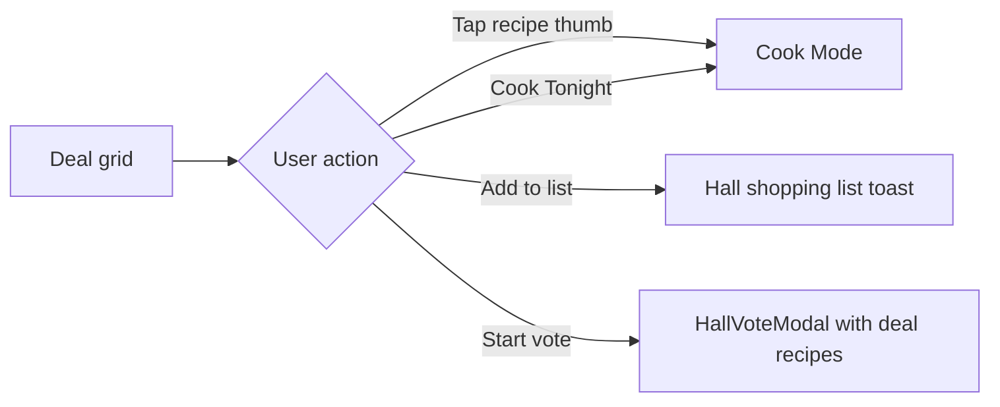
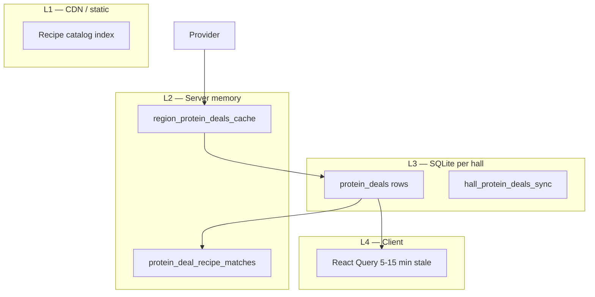

# Protein Deals V1 — Product & Technical Design

**Date:** June 22, 2026  
**Role:** Product strategist + systems designer  
**Goal:** A hall sees proteins on sale and **immediately gets meal ideas** — not a flyer browser, not a grocery app.  
**Status:** Design only — **do not implement** from this doc without explicit build approval.  
**North Star tie-in:** Deal → recipe → vote → shopping list is the canteen manager’s Tuesday loop.

**Related:** `hall-pro-audit.md`, `navigation-v3.md`, `firefighter-user-journeys.md`  
**Existing code (partial):** `shared/protein-deals/types.ts`, `server/grocery-deals/*`, `deals_providers/*`, `hall-protein-deals-page.tsx`, migration `030_protein_deals.sql`

---

## Executive summary

Protein Deals V1 is a **hall-scoped, protein-only** surface that answers one question:

> *“Chicken thighs are $3.99 at No Frills — what should we cook for 10?”*

**V1 success** = cook or canteen manager opens the hall dashboard, sees a deal **with a recipe photo**, taps once, and lands in **Cook Mode** or **Tonight’s pick** within 10 seconds.

**Not in V1:** Full grocery flyers, produce/dairy, price history, multi-retailer comparison UI, department procurement, Flipp scraping, manual flyer entry by users.

**Modes at launch:**

| Mode | Purpose |
|------|---------|
| `demo` | Pilots + dev — realistic banner-matched sample deals |
| `disabled` | Production default until provider contract — honest “coming soon” |
| `provider` | Live HTTP provider when `GROCERY_DEALS_API_URL` configured |
| `admin_seeded` | Support / sales demos |

---

## Product principles

| # | Principle | Implication |
|---|-----------|-------------|
| 1 | **Meal-first, deal-second** | UI shows recipe thumbnail beside every deal; never a price-only list |
| 2 | **One-time hall setup** | Postal code + preferred stores; captain does once |
| 3 | **Proteins only** | Normalizer rejects non-protein; no category creep |
| 4 | **Honest data** | Demo labeled “Sample deals”; disabled never fakes live prices |
| 5 | **Hall Pro earns unlock** | Free hall sees deals + 1 meal idea; Pro gets full match + list + refresh |
| 6 | **Fail open on read** | Stale cache beats empty screen; refresh is explicit |
| 7 | **Tonight handoff** | Every match links to Cook Mode / vote / hall list — not recipe blog |

---

## User stories (V1)

| Persona | Story | Acceptance |
|---------|-------|------------|
| **Hall cook** | See what’s cheap → pick a meal → start cooking | Dashboard shows deal + top recipe; 1 tap to cook |
| **Canteen manager** | Know what to buy before Costco | Add deal protein to hall shopping list |
| **Captain** | Set stores once | Setup completes in &lt;2 min; crew never sees UUID settings |
| **Probie** | Understand why this meal | `match_reason` visible (“Good fit for thighs”) |
| **Free hall member** | Taste value before Pro | See 3 deal headlines + 1 unlocked recipe match |

---

## System context

```mermaid
flowchart TB
  subgraph Client
    Dash[Hall dashboard card]
    Page[/hall/deals page]
    Setup[Store setup sheet]
  end

  subgraph API
    Prefs[/grocery/preferences]
    Deals[/protein-deals]
    Match[/protein-deals/:id/recipes]
    Highlight[/protein-deals/highlight]
  end

  subgraph Server core
    Store[protein-deals store]
    Matcher[protein-matcher]
    Billing[userHasFeature protein_deals]
  end

  subgraph Providers
    Locator[store_locator_providers]
    DealsProv[deals_providers]
    Demo[manual-test-provider]
    HTTP[provider HTTP adapter]
  end

  subgraph Data
    DB[(SQLite protein_deals + preferences)]
    Catalog[(Approved recipe catalog)]
  end

  Dash --> Highlight
  Page --> Deals
  Page --> Match
  Setup --> Prefs
  Deals --> Store
  Store --> Billing
  Store --> DealsProv
  DealsProv --> Demo
  DealsProv --> HTTP
  Prefs --> Locator
  Store --> DB
  Matcher --> Catalog
  Match --> Matcher
```

---

# 1. Data model

## 1.1 Existing tables (keep)

| Table | Purpose |
|-------|---------|
| `protein_deals` | Hall-scoped protein sale rows (migration 030) |
| `hall_grocery_preferences` | Postal code, country, radius |
| `hall_preferred_stores` | Ordered store list per hall |
| `grocery_stores` | Store locator cache / seed |
| `halls.postal_code` | Fallback location |
| `halls.country` | CA / US |

## 1.2 `protein_deals` — V1 column additions

Extend existing table; do not create parallel `retailer_deals` writes for new code.

| Column | Type | Notes |
|--------|------|-------|
| `source_item_name` | TEXT | Raw flyer string before normalization |
| `store_id` | TEXT NULL | FK → `grocery_stores.id` when known |
| `provider` | TEXT | `demo` \| `provider` \| `admin_seeded` |
| `flyer_url` | TEXT NULL | Optional external proof link |
| `deal_rank` | INTEGER | Sort key after quality scoring (lower = better) |
| `match_preview_slug` | TEXT NULL | **Denormalized** top recipe slug for dashboard speed |
| `match_preview_title` | TEXT NULL | Denormalized title |
| `match_preview_reason` | TEXT NULL | Denormalized `match_reason` |
| `expires_at` | TEXT NULL | Alias clarity for `valid_to`; keep both for compat |

**Indexes (add):**

```sql
CREATE INDEX idx_protein_deals_hall_rank ON protein_deals(hall_id, deal_rank ASC);
CREATE INDEX idx_protein_deals_hall_expires ON protein_deals(hall_id, valid_to);
```

## 1.3 New: `protein_deal_recipe_matches` (optional cache)

Precompute top N recipes per deal on ingest — avoids catalog scan on every dashboard load.

| Column | Type | Notes |
|--------|------|-------|
| `deal_id` | TEXT PK (part) | FK `protein_deals.id` ON DELETE CASCADE |
| `recipe_slug` | TEXT PK (part) | |
| `rank` | INTEGER | 1 = best |
| `match_score` | INTEGER | Matcher score |
| `match_reason` | TEXT | |
| `computed_at` | TEXT | ISO timestamp |

**Policy:** Populate on deal insert/refresh; max 12 rows per deal; invalidate when catalog version bumps.

## 1.4 New: `hall_protein_deals_sync` (refresh metadata)

| Column | Type | Notes |
|--------|------|-------|
| `hall_id` | TEXT PK | |
| `last_success_at` | TEXT NULL | |
| `last_attempt_at` | TEXT NULL | |
| `last_error` | TEXT NULL | |
| `provider` | TEXT | Mode at last sync |
| `deal_count` | INTEGER | |
| `next_allowed_refresh_at` | TEXT NULL | Rate limit captain refresh |

## 1.5 New: `region_protein_deals_cache` (provider cache)

Shared across halls in same postal prefix — reduces provider API cost.

| Column | Type | Notes |
|--------|------|-------|
| `cache_key` | TEXT PK | `{country}:{postal_fsa}:{provider}:{week}` |
| `payload_json` | TEXT | Normalized `ProviderDealInput[]` |
| `fetched_at` | TEXT | |
| `expires_at` | TEXT | Typically flyer week end |

**FSA** = first 3 chars of CA postal / US ZIP prefix.

## 1.6 Shared types (`shared/protein-deals/types.ts` — V1 target)

```typescript
// Add to ProteinDealRow
source_item_name?: string | null;
store_id?: string | null;
provider?: "demo" | "provider" | "admin_seeded";
flyer_url?: string | null;
deal_rank?: number;
match_preview?: ProteinDealMatchedRecipe | null;

// Add to ProteinDealsResponse
demo_labeled: boolean;           // true when mode === "demo"
recipe_matches_included: boolean; // false when hall_pro_locked partial
refresh_available_at: string | null;
sync: {
  last_success_at: string | null;
  deal_count: number;
};

// Dashboard-specific
export interface ProteinDealsHighlight {
  headline: string;              // "Chicken thighs $3.99 · No Frills"
  deal: ProteinDealRow | null;
  top_recipe: ProteinDealMatchedRecipe | null;
  cta: "setup" | "view" | "cook" | "upgrade";
  setup_complete: boolean;
  hall_pro_locked: boolean;
}
```

---

# 2. API architecture

Base path: **`/api/halls/:hallId/protein-deals`**  
Legacy alias: `/api/halls/:hallId/deals` (301-equivalent routing — keep for compat).

Grocery setup: **`/api/halls/:hallId/grocery/*`** (unchanged paths).

## 2.1 Auth & permissions matrix

| Endpoint | Auth | Hall member | Hall Pro | Captain |
|----------|------|-------------|----------|---------|
| `GET /protein-deals` | ✓ | `view_hall_dashboard` | Partial payload if locked | — |
| `GET /protein-deals/highlight` | ✓ | ✓ | Partial OK | — |
| `GET /protein-deals/:dealId/recipes` | ✓ | ✓ | **Required** | — |
| `POST /protein-deals/refresh` | ✓ | ✓ | **Required** | Optional: `manage_settings` for manual refresh |
| `POST /protein-deals/:dealId/shopping-list` | ✓ | ✓ | **Required** | — |
| `GET /grocery/preferences` | ✓ | ✓ | — | — |
| `PUT /grocery/preferences` | ✓ | — | — | `manage_settings` |
| `GET /grocery/stores/nearby` | ✓ | ✓ | — | — |

**402** `{ message, feature: "protein_deals" }` when Pro required.  
**403** not a member. **404** deal not in hall.

## 2.2 `GET /api/halls/:hallId/protein-deals`

**Purpose:** Full deals page payload — **includes inline `top_recipes` per deal** (V1 key change).

**Query params:**

| Param | Default | Notes |
|-------|---------|-------|
| `include_recipes` | `true` | `false` for lightweight poll |
| `limit` | `24` | Max deals |

**Behavior:**

1. Check membership.
2. Resolve `hallPro = userHasFeature(..., protein_deals)`.
3. If `setup_complete` and cache stale → `ensureFreshProteinDealsForHall` (async-safe, see caching).
4. Build response:
   - **Pro:** all deals, each with `top_recipes: ProteinDealMatchedRecipe[]` (max 3).
   - **Free:** `deals: []`, `teaser.top_deals` (max 3), **one** `teaser.sample_recipes` for best deal only.

**Response shape:** `ProteinDealsResponse` + `deals[].top_recipes`.

## 2.3 `GET /api/halls/:hallId/protein-deals/highlight`

**Purpose:** Hall dashboard card — **single best deal + single best recipe** in one round trip.

**Response:** `ProteinDealsHighlight`

**Selection algorithm:**

1. If `!setup_complete` → `cta: "setup"`.
2. Else if `hall_pro_locked` && best deal exists → headline + deal, `top_recipe` = first match if allowed else null, `cta: "upgrade"`.
3. Else if deal + recipe → `cta: "cook"`.
4. Else if deals but no match → `cta: "view"`.
5. Else → `cta: "view"`, empty state copy.

**No Pro required** for highlight read (teaser).

## 2.4 `GET /api/halls/:hallId/protein-deals/:dealId/recipes`

**Purpose:** Full match list when user expands a deal.

- **Hall Pro required** (402 if locked).
- Returns `{ deal, recipes: ProteinDealMatchedRecipe[] }` (max 12).
- Prefer read from `protein_deal_recipe_matches` cache; compute on miss.

## 2.5 `POST /api/halls/:hallId/protein-deals/refresh`

**Purpose:** Captain/cook manual refresh.

- Hall Pro required.
- Rate limit: 1 per hall per 15 minutes (`next_allowed_refresh_at`).
- Returns `{ ok, inserted, deals: ProteinDealsResponse }`.

## 2.6 `POST /api/halls/:hallId/protein-deals/:dealId/shopping-list`

**Purpose:** Add normalized protein line to **hall shared shopping list**.

- Hall Pro required.
- Body optional: `{ servings?: number }`.
- Item name: `proteinDealLabel(deal)`; section: `"Protein"`; quantity: price/unit.
- Also requires `shared_shopping_lists` feature when that gate is enforced (align in build).

## 2.7 `PUT /api/halls/:hallId/grocery/preferences`

Unchanged contract (`saveGroceryPreferencesSchema`).

**On success:**

1. Save prefs + preferred stores.
2. Trigger `refreshProteinDealsFromProvider(hallId)`.
3. Return `{ preferences, deals }` — deals respect Pro lock.

## 2.8 Client API module (`client/src/lib/protein-deals/api.ts`)

| Function | Endpoint |
|----------|----------|
| `fetchHallProteinDeals` | GET list |
| `fetchProteinDealsHighlight` | GET highlight (**new**) |
| `fetchProteinDealRecipes` | GET recipes |
| `refreshHallProteinDeals` | POST refresh |
| `addProteinDealToShoppingList` | POST shopping-list |
| `trackProteinDealClicked` | analytics beacon |

**React Query keys:**

- `["protein-deals", hallId]`
- `["protein-deals-highlight", hallId]`
- `["protein-deal-recipes", hallId, dealId]`

---

# 3. Provider architecture

## 3.1 Pipeline overview

```
┌─────────────┐    ┌──────────────┐    ┌─────────────────┐    ┌──────────────┐
│ Mode resolve│───▶│ Fetch raw    │───▶│ Normalize protein│───▶│ Quality filter│
└─────────────┘    │ deals        │    │ (deal-normalizer)│    │ (deal-quality)│
                   └──────────────┘    └─────────────────┘    └──────┬───────┘
                                                                      │
┌─────────────┐    ┌──────────────┐    ┌─────────────────┐           │
│ Recipe match│◀───│ Persist rows │◀───│ Dedupe + rank   │◀──────────┘
│ + preview   │    │ per hall     │    │ by hall stores  │
└─────────────┘    └──────────────┘    └─────────────────┘
```

## 3.2 Mode resolver (`deals_providers/grocery-deals-mode.ts`)

| Env | Production default | Dev/test default |
|-----|-------------------|------------------|
| `PROTEIN_DEALS_MODE` | `disabled` | `demo` |
| Fallback | `GROCERY_DEALS_MODE` | same |

**Rule:** `disabled` → never call provider; `available: false`; `integration_coming_soon: true` when setup complete.

## 3.3 Store locator provider (setup phase)

**Package:** `store_locator_providers/` (existing pattern)

| Provider | When | Input | Output |
|----------|------|-------|--------|
| `manual_seed` | Always | postal, country | `grocery_stores` rows |
| `google_places` | Optional env | postal, radius | Store list with banner normalization |

**Banner normalization map:** e.g. `LOBLAWS` → `No Frills`, `WALMART SUPERCENTER` → `Walmart`.

Setup saves `hall_preferred_stores` with `priority` order (max 12).

## 3.4 Deals providers (fetch phase)

Pluggable interface:

```typescript
interface ProteinDealsProvider {
  name: string;
  supports(country: "CA" | "US"): boolean;
  fetchDeals(input: {
    postal_code: string;
    country: "CA" | "US";
    banners: string[];
    store_ids: string[];
  }): Promise<ProviderDealInput[]>;
}
```

| Implementation | Mode | Notes |
|----------------|------|-------|
| `ManualTestProvider` | `demo`, `admin_seeded` | `fetchDemoProteinDealsForBanners` — **already exists** |
| `HttpProviderAdapter` | `provider` | `GROCERY_DEALS_API_URL` — **already exists** |
| `AdminSeedProvider` | `admin_seeded` | Admin POST seed endpoint |

**Registry:** `deals_providers/index.ts` selects by mode.

## 3.5 Normalization (`deal-normalizer.ts`)

- Input: `item_name` string.
- Output: `{ protein_type, protein_cut }` or reject.
- **V1 proteins:** chicken, beef, pork, sausage, turkey, fish, seafood.
- Reject: deli salads, plant protein, jerky, protein bars, pet food (`deal-quality.ts`).

## 3.6 Quality & ranking

**Per-hall filter:**

1. Keep rows where `store_name` or `store_id` matches `hall_preferred_stores`.
2. Drop expired (`valid_to < now`).
3. Dedupe by `(protein_type, protein_cut)` — keep lowest price.

**`deal_rank` score (lower is better):**

| Factor | Weight |
|--------|--------|
| Price / lb (normalized) | Primary sort |
| Preferred store priority | −10 × priority index |
| Has `protein_cut` | −5 |
| Matcher found preview recipe | −20 |

## 3.7 Recipe matching (`deals_providers/protein-matcher.ts`)

Existing scorer — V1 enhancements (design only):

| Enhancement | Purpose |
|-------------|---------|
| Boost `firehall_classics` catalog tags | Better hall-fit meals |
| Penalize recipes with cook time &gt; 90 min when deal is `quick` cut | Shift-night realism |
| Return `match_preview` on ingest | Dashboard speed |

**Catalog version:** `GOLDEN_CATALOG_INDEX.generatedAt` — bust matcher + match cache on change.

## 3.8 Provider failure behavior

| Condition | User sees | Data |
|-----------|-----------|------|
| `disabled` mode | “Integration coming soon” | Empty or last stale with banner |
| Provider timeout | “Deals temporarily unavailable” | Last good `protein_deals` rows if &lt; 7 days old |
| Provider empty | “No protein deals this week” | Empty |
| Demo mode | “Sample deals near your stores” badge | Demo data |

**Never:** silent fallback to fake prices in `disabled` production mode.

---

# 4. UI flows

Routes (align with `navigation-v3.md`):

| Screen | Route | Notes |
|--------|-------|-------|
| Dashboard card | inline on `/hall` | Primary discovery |
| Full deals | `/hall/deals` | Rename from `/hall/protein-deals` (redirect old) |
| Setup | `/hall/deals/setup` | One-time |
| Recipe cook | `/tonight/recipe/:slug?from=deal&dealId=` | V1 may use `/recipes/:slug` + Cook Mode |

## 4.1 Flow A — First-time setup (captain)

```mermaid
flowchart TD
  A[Hall dashboard card: Set up stores] --> B[/hall/deals/setup]
  B --> C[Enter postal code]
  C --> D[Load nearby stores]
  D --> E[Select 1-3 banners]
  E --> F[Save preferences]
  F --> G[Auto refresh deals]
  G --> H[/hall/deals with results]
  H --> I[Toast: Sample deals or Live deals]
```

**Setup UI rules:**

- 3 steps max: Location → Stores → Done.
- Pre-fill postal from `halls.postal_code` or hall city if available.
- Default country from `halls.country`.
- No Hall Pro required for setup.

## 4.2 Flow B — Dashboard glance (hall cook)

**Card layout (V1):**

```
┌─────────────────────────────────────────┐
│ 🏷 This Week's Protein Deals    Find Meals│
├─────────────────────────────────────────┤
│ [recipe thumb]  Chicken Thighs $3.99/lb  │
│                 No Frills · Good fit for │
│                 thighs                   │
│                 [ Cook Tonight ]           │
├─────────────────────────────────────────┤
│ +2 more deals →                          │
└─────────────────────────────────────────┘
```

**States:**

| State | Card content | CTA |
|-------|--------------|-----|
| No hall | Join hall copy | Join |
| No setup | “Set up stores (1 min)” | Setup |
| Locked + teaser | Best deal + blurred 2nd recipe | “Unlock with Hall Pro” |
| Pro + match | Deal + recipe thumb | **Cook Tonight** |
| Pro + no deals | “No deals this week” | Browse generator |
| Demo | Badge: “Sample deals” | Same as Pro visually |

**Tap behavior:**

- **Cook Tonight** → recipe Cook Mode with `source=protein_deal`.
- **Card body** → `/hall/deals`.
- **Find Meals** → `/hall/deals` focused on top deal.

## 4.3 Flow C — Full deals page (Pro)



**Deal card (V1):**

- Header: protein label + price + store badge.
- **Inline recipe strip:** 3 horizontal recipe cards (image, title, reason) — visible without extra tap.
- Actions: Cook · Add to list · Vote with these meals.

**Remove:** Two-step “Find Meals” then separate section below (current UX friction).

## 4.4 Flow D — Free hall (teaser)

- Show 3 deal headlines with prices.
- Show **1 full recipe match** for the `#1` deal only (hero recipe card).
- Remaining recipes behind `PaywallGate` inline — not redirect to settings.
- CTA: “Ask captain to enable Hall Pro” + copy message button.

## 4.5 Flow E — Tonight integration

When user picks recipe from deal:

1. Set `TonightContext` `{ recipeSlug, dealId, hallId }`.
2. Open Cook Mode or `/tonight` hub card “Tonight’s pick: {title} (on sale)”.
3. Optional: pre-fill generator protein filter from `deal.protein_type`.

## 4.6 Empty & error states

| Copy | When |
|------|------|
| “Set up your stores to see protein deals.” | `!setup_complete` |
| “Protein deals integration coming soon.” | `disabled` + setup done |
| “Sample deals near your stores” | `demo` mode |
| “No protein deals at your stores this week.” | Empty after valid fetch |
| “Showing last week’s deals — tap Refresh.” | Stale cache &gt; 24h |

---

# 5. Hall dashboard integration

## 5.1 Placement

`HallDashboardV2` section order (V1 recommendation):

1. Header + quick actions  
2. **Tonight’s meal** (existing)  
3. **Protein deals card** ← move **above** activity/leaderboard teasers  
4. Active vote highlight  
5. Shopping list card  
6. Supplies / canteen  
7. Rest unchanged  

**Rationale:** Goal is meal ideation — deals belong next to “Tonight’s meal,” not below social teasers.

## 5.2 Component contract (`HallProteinDealsCard` V1)

**Data source:** `GET /protein-deals/highlight` only — **not** full list GET.

**Props:** `activeHallId`, `onCookTonight?(slug)`, `className`

**Renders:**

- `highlight.headline`
- Recipe thumb from `highlight.top_recipe`
- Primary button from `highlight.cta`
- `demo_labeled` chip when applicable

**Loading:** Skeleton with shimmer — never empty collapse.

## 5.3 Cross-links

| From | To |
|------|-----|
| Shopping list card | “Add from deals” → `/hall/deals` |
| Tonight’s meal empty | “See what’s on sale” → highlight card |
| Generator | Banner when `highlight.deal` exists: “Chicken thighs on sale — 12 meals” |

---

# 6. Hall Pro integration

## 6.1 Feature flag

Billing key: **`protein_deals`** (`HALL_PRO_FEATURES` — add to `HallProAdminPanel` UI list).

Server: `userHasFeature(userId, "protein_deals", { hall_id })` on mutations and full recipe endpoints.

## 6.2 Free vs Pro matrix (V1)

| Capability | Free hall | Hall Pro |
|------------|-----------|----------|
| Store setup | ✓ | ✓ |
| See deal headlines (top 3) | ✓ | ✓ |
| See 1 recipe match (best deal) | ✓ | ✓ |
| All recipe matches per deal | — | ✓ |
| Inline recipe strips on all deals | — | ✓ |
| Add deal to hall shopping list | — | ✓ |
| Manual refresh | — | ✓ |
| Cook Mode from deal | ✓ (1 recipe) | ✓ (all) |
| Start vote from deal recipes | ✓ | ✓ |

**Strategic note (`hall-pro-audit.md`):** Protein deals are a **conversion driver**, not the sole Pro justification. Pair paywall copy with shopping list value.

## 6.3 Paywall UX

- **Never** send to `/plans` for Hall Pro.
- Inline lock card: “Hall Pro unlocks all meal matches and shopping list add.”
- Primary CTA → `/hall/settings/billing` (or `/hall/settings` per navigation v3).
- Captain sees “Start trial” if `manage_billing`.

## 6.4 Trial trigger (recommended)

Auto-start Hall Pro trial when:

- Hall completes protein setup **and**
- Any member taps “Cook Tonight” from a deal  

→ Toast: “14-day Hall Pro trial started — full deals unlocked.”

## 6.5 Demo mode + Pro honesty

When `mode === "demo"`:

- Show badge: **“Sample deals — for demonstration”**
- Do not show fake “integration coming soon”
- Stripe checkout copy must not claim live flyer data until `provider` mode

---

# 7. Analytics events

Existing events (`shared/analytics/events.ts`) — keep and extend.

## 7.1 Event catalog

| Event | When | Metadata |
|-------|------|----------|
| `protein_setup_started` | Open setup | `hall_id`, `source` |
| `protein_setup_completed` | Save prefs | `hall_id`, `store_count`, `country` |
| `postal_code_saved` | On save | `hall_id` |
| `nearby_stores_loaded` | Store search | `hall_id`, `count` |
| `preferred_store_added` | On save | `hall_id`, `count` |
| `preferred_store_removed` | Delete store | `hall_id`, `store_id` |
| `protein_deals_viewed` | Full page load | `hall_id`, `deal_count`, `mode`, `hall_pro` |
| `protein_deals_highlight_viewed` | Dashboard card impression | `hall_id`, `has_recipe`, `cta` |
| `protein_deal_clicked` | Tap deal row | `hall_id`, `deal_id`, `protein_type`, `protein_cut` |
| `protein_recipe_generated` | Matches computed | `hall_id`, `deal_id`, `match_count` |
| `protein_recipe_selected` | **NEW** Tap recipe | `hall_id`, `deal_id`, `recipe_slug`, `rank` |
| `protein_cook_tonight_clicked` | **NEW** Cook CTA | `hall_id`, `deal_id`, `recipe_slug` |
| `protein_shopping_list_created` | Add to list | `hall_id`, `deal_id` |
| `protein_deals_refresh_clicked` | **NEW** Manual refresh | `hall_id`, `success` |
| `protein_deals_paywall_viewed` | **NEW** Teaser lock | `hall_id`, `surface` |
| `protein_deals_empty` | **NEW** Zero deals | `hall_id`, `mode`, `setup_complete` |

## 7.2 Funnel metrics (dashboard)

| Metric | Formula |
|--------|---------|
| Setup completion rate | `protein_setup_completed` / halls with `postal_code` |
| Deal → recipe rate | `protein_recipe_selected` / `protein_deals_highlight_viewed` |
| Recipe → cook rate | `protein_cook_tonight_clicked` / `protein_recipe_selected` |
| Pro conversion assist | Halls with `protein_shopping_list_created` → trial → paid |

## 7.3 Client tracking

- Impression: `IntersectionObserver` on dashboard card → `protein_deals_highlight_viewed` once per session.
- Click tracking via existing `trackProteinDealClicked` + new helpers in `client/src/lib/protein-deals/analytics.ts`.

---

# 8. Caching strategy

## 8.1 Layers



## 8.2 TTL policy

| Layer | Key | TTL | Invalidate |
|-------|-----|-----|------------|
| Region provider cache | postal FSA + week | 6 hours | Manual admin clear; new flyer week |
| Hall deals rows | `hall_id` | Until next successful sync | POST refresh; prefs change |
| Recipe match cache | `deal_id` | 24 hours | Catalog version bump; deal refresh |
| Matcher catalog | in-memory | Process lifetime | `resetProteinMatcherCatalogCache()` on deploy |
| Highlight API | derived | No cache — reads DB | — |
| Client `highlight` | React Query | `staleTime: 5 min` | Window focus refetch |
| Client full deals | React Query | `staleTime: 10 min` | After refresh mutation |

## 8.3 Refresh triggers

| Trigger | Sync behavior |
|---------|---------------|
| `GET /protein-deals` when `last_success_at` &gt; 6h | Background `ensureFresh` if setup complete |
| `PUT /grocery/preferences` | Immediate sync |
| `POST /refresh` | Forced sync (rate limited) |
| Cron (optional V1.1) | Daily 6am local per hall timezone — **out of V1 scope** |

## 8.4 Stale-while-revalidate

If provider fails:

- Serve existing `protein_deals` if `fetched_at` within **7 days**.
- Set `unavailable_message` + `stale: true` in response.
- Dashboard still shows last recipe previews.

## 8.5 Rate limits

| Action | Limit |
|--------|-------|
| Manual refresh | 1 / 15 min / hall |
| Nearby stores search | 10 / min / user |
| Recipe match compute | Use cache; max 50 compute/min/hall |

---

# 9. Admin & operations

| Endpoint | Purpose |
|----------|---------|
| `GET /api/admin/deals` | Hall deal counts, modes, last refresh |
| `POST /api/admin/deals/seed/:hallId` | Seed demo deals |
| `POST /api/admin/deals/refresh/:hallId` | Force refresh |
| `POST /api/admin/deals/clear-stale` | GC old rows |

**Audit scripts (keep):** `npm run audit:protein-deals`, `scripts/test-protein-deals.ts`

---

# 10. V1 scope boundaries

## In scope

- Protein-only deals near hall stores  
- Demo + HTTP provider modes  
- Deal → recipe inline on dashboard and deals page  
- Setup flow, highlight API, match cache  
- Hall Pro teaser + full unlock  
- Shopping list add from deal  
- Analytics funnel  

## Out of scope (V1.1+)

- Live Flipp / retailer scraping  
- User-submitted flyer photos  
- Price drop notifications push  
- Multi-hall deal comparison  
- US-wide provider without CA pilot proof  
- Pantry/produce deals  
- Automatic “order from Instacart”  

---

# 11. Launch checklist (design → build)

| # | Item | Owner |
|---|------|-------|
| 1 | Migration: `protein_deals` columns + sync table | Eng |
| 2 | `GET /highlight` with `top_recipe` | Eng |
| 3 | Inline `top_recipes` on list GET | Eng |
| 4 | Dashboard card redesign (recipe thumb) | Design/Eng |
| 5 | Remove two-step Find Meals UX | Eng |
| 6 | Demo badge + disabled honesty copy | Eng |
| 7 | `protein_deals` on Hall Pro admin panel | Eng |
| 8 | Match cache table + ingest hook | Eng |
| 9 | Region provider cache | Eng |
| 10 | Analytics new events | Eng |
| 11 | 5-hall pilot with canteen managers | Ops |
| 12 | Provider contract or stay demo-labeled | Biz |

---

# 12. Success criteria (90 days post-launch)

| Metric | Target |
|--------|--------|
| Halls with setup complete | 40% of active halls |
| Dashboard card CTR | ≥15% of `/hall` DAU |
| Deal → recipe tap | ≥50% of card viewers |
| Recipe → cook | ≥30% of recipe taps |
| Shopping list add from deal | ≥10% of Pro halls/week |
| Support tickets re: “fake prices” | 0 in demo-labeled mode |

---

*End of Protein Deals V1 design.*
