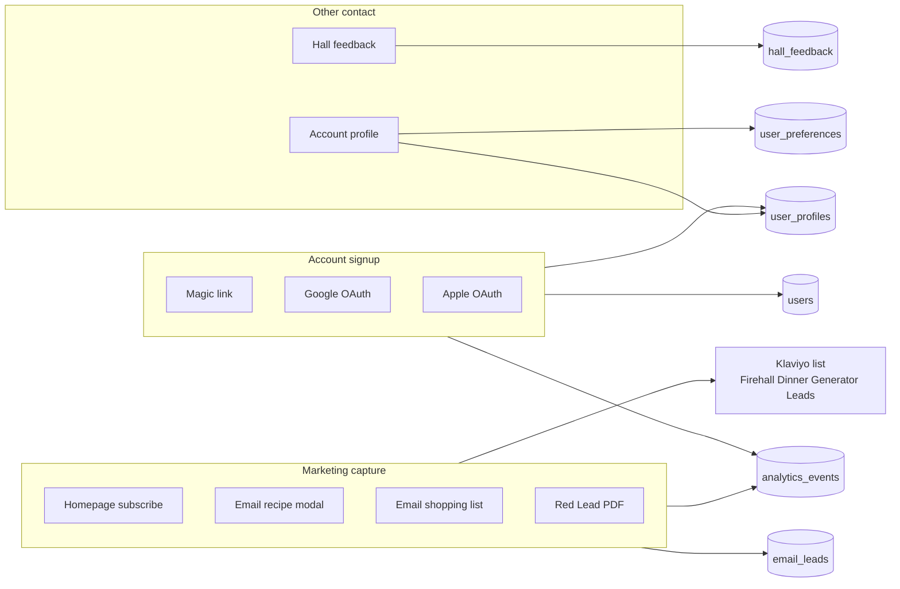

# Signup & Contact Data Map

Audit date: 2026-06-22 (updated for founder Signup Dashboard)  
Scope: every user-facing path that collects email or contact/profile information, where it is stored, and how admins can access it.

---

## Founder admin dashboards

| Route | Purpose | Auth | SEO |
|-------|---------|------|-----|
| **`/admin/signups`** | Unified signup CRM — registered users + unconverted email leads in one searchable table | `ADMIN_SECRET` via `x-admin-key` (`client/src/lib/admin-api.ts`) | `noindex, nofollow` via `AdminPageShell`; excluded from `sitemap.xml`; `robots.txt` disallows `/admin` |
| **`/admin/leads`** | Email-only leads from marketing forms (homepage, generator, PDF, shopping list, etc.) | Same | Same |
| `/admin/users` | Legacy user list + detail (still linked from signups drawer) | Same | Same |

**Security (fail closed):** If `ADMIN_SECRET` is unset, `requireAdmin` returns **503** and no admin data is served. Wrong key → **401**. Routes are not in public nav (`client/src/lib/app-nav.ts` excludes `/admin`).

**Analytics (product DB):** `admin_signups_viewed`, `admin_signup_opened`, `admin_signups_exported` (server-side on list/export/drawer open).

---

## Summary

Firehall Meals has **two parallel contact pipelines**:

1. **Marketing leads** — anonymous email capture forms → Klaviyo list + local `email_leads` CRM + `email_capture` analytics.
2. **Accounts** — magic link / Google / Apple sign-in → `users` + `user_profiles` + optional profile fields; **not** auto-synced to Klaviyo unless the user also hits a marketing form or an admin clicks “Add to Klaviyo.”

A third, separate channel is **Hall Feedback** (optional email + message) → `hall_feedback` only — no Klaviyo, no leads CRM, no admin UI today.

---

## Master table

| # | Form / component | API endpoint | DB table(s) | Klaviyo | Analytics (product) | Fields collected | `/admin/signups` | `/admin/leads` | Exportable |
|---|------------------|--------------|-------------|---------|---------------------|------------------|------------------|----------------|------------|
| 1 | `HomeEmailCapture` | `POST /api/homepage-subscribe` | `email_leads` | List + **Homepage Subscriber** event | `email_capture` (`source: homepage`) | `email` | Yes (lead row or merged user) | Yes — filter Homepage | Yes — both CSVs |
| 2 | `EmailModal` | `POST /api/email-recipe` | `email_leads` | List + **Recipe Generated** event | `email_capture` (`source: generator`) | `email` + full recipe payload | Yes | Yes — filter Generator | Yes |
| 3 | `ShoppingListModal` | `POST /api/email-shopping-list` | `email_leads` | List + **Shopping List Requested** event | `shopping_list_action` only (not `email_capture`) | `email` + shopping list sections | Yes | Yes — filter Shopping list | Yes |
| 4 | `RedLeadPdfCapture` | `POST /api/lead-magnet/red-lead` | `email_leads` | List + **Lead Magnet Downloaded** event | `email_capture` (`source: red_lead`) | `email` | Yes | Yes — filter Red Lead PDF | Yes |
| 5 | `SignInSheet` (magic link) | `POST /api/auth/magic-link` → `GET /api/auth/verify-magic` | `auth_magic_links` (temp), then `users` | No | `account_created` / `login` (`provider: email`) | `email` | Yes — registered user row | No (account, not lead) | Signups CSV |
| 6 | `SignInSheet` (Google) | `POST /api/auth/google` | `users`, `user_profiles` | No | `account_created` / `login` | `email`, `first_name`, `last_name` | Yes | No | Signups CSV |
| 7 | `SignInSheet` (Apple) | `POST /api/auth/apple` | `users`, `user_profiles` | No | `account_created` / `login` | `email`, name (first sign-in) | Yes | No | Signups CSV |
| 8 | `HallFeedbackModal` | `POST /api/hall-feedback` | `hall_feedback` | No | GA4 `hall_feedback_*` only | `message`, optional `email` | **No** | **No** | **No** |
| 9 | `AccountProfileForm` | `PATCH /api/auth/profile` | `user_profiles`, `user_preferences` | No | `profile_updated` | Name, hall context, prefs | Yes (profile on user detail) | No | Signups CSV (partial) |
| 10 | Hall join / create | `POST /api/halls`, invite accept | `halls`, `hall_members` | No | `hall_created`, `hall_joined` | Account email (existing user) | Yes — hall columns | N/A | Signups CSV |
| 11 | Admin manual Klaviyo | `POST /api/admin/users/:userId/klaviyo` | `email_leads.klaviyo_synced` | List subscribe | — | Existing user email | Yes — Klaviyo column | If lead exists | — |
| 12 | Admin-created users | `upsertEmailUser` (auth store) | `users` | No | — | `email` | Yes | No | Signups CSV |

**Aggregate analytics (counts only, no PII export):** `/admin/analytics` shows total `email_captures` from `analytics_events`.

**External export:** Klaviyo dashboard for list **“Firehall Dinner Generator Leads”** (`server/klaviyo.ts`).

---

## 1. Homepage email subscribe

| | |
|---|---|
| **Component** | `client/src/components/home/home-email-capture.tsx` (`HomeEmailCapture`) |
| **Used on** | `client/src/pages/home.tsx` |
| **API** | `POST /api/homepage-subscribe` |
| **Schema** | `homepageSubscribeSchema` — `email` only (`shared/schema.ts`) |
| **DB** | `email_leads` via `captureEmailLead()` → `recordEmailLead({ source: "homepage", signup_form: "homepage-subscribe" })` |
| **Klaviyo** | `subscribeToList(email)` + metric **Homepage Subscriber** (`trackHomepageSubscriber`) |
| **Analytics** | Client: `trackHomepageCaptureView`, `trackHomepageCaptureSubmit` → product `email_capture` with `source: homepage`, `capture_type: homepage_subscribe`. GA4: `setAnalyticsUserId` (SHA-256 hash of email). |
| **Admin** | `/admin/leads` (filter: Homepage). User list shows `email_capture_source` if same email later creates an account. |
| **Export** | `GET /api/admin/leads/export?filter=homepage` |

---

## 2. Email recipe modal

| | |
|---|---|
| **Component** | `client/src/components/email-modal.tsx` (`EmailModal`) |
| **Used on** | Generator, explore recipe detail, curated package (`generator.tsx`, `explore-recipe-detail-page.tsx`, `curated-package.tsx`) |
| **API** | `POST /api/email-recipe` |
| **Schema** | `emailRecipeSchema` — `email`, `recipe_title`, `primary_protein`, `healthiness_level`, `crew_size`, `ingredients[]`, `steps[]`, `pro_tips[]`, `macros`, `timestamp`, optional `capture_source` |
| **DB** | `email_leads` (`source: "generator"`, `signup_form: "email-recipe"`). Recipe body is **not** stored locally — only sent to Klaviyo event properties. |
| **Klaviyo** | `subscribeToList(email)` + metric **Recipe Generated** with full recipe payload |
| **Analytics** | Client: `trackEmailModalOpened`, `trackEmailSubmitted` → product `email_capture` with `capture_type: email_recipe`, `source: generator` (hardcoded default even on explore/package pages). Earned prompts: `email_capture_prompt_shown` on generator. |
| **Admin** | `/admin/leads` (filter: Generator). Converted users linked when email matches `users.email`. |
| **Export** | Leads CSV; users CSV if converted |

**Note:** Server always records lead `source: "generator"` regardless of which page opened the modal.

---

## 3. Email shopping list

| | |
|---|---|
| **Component** | `client/src/components/shopping-list-modal.tsx` (`ShoppingListModal`) |
| **Used on** | Generator, golden/breakfast/performance/smoothie/explore recipe pages, curated package |
| **API** | `POST /api/email-shopping-list` |
| **Schema** | `emailShoppingListSchema` — `email`, `recipe_title`, `shopping_list_sections[]`, `generator_type` (`meal` \| `pizza`), `timestamp` |
| **DB** | `email_leads` (`source: "shopping_list"`, `signup_form: "email-shopping-list"`) |
| **Klaviyo** | `subscribeToList(email)` + metric **Shopping List Requested** |
| **Analytics** | `shopping_list_open`, `shopping_list_action` with `action: "email"` — **does not** fire product `email_capture` |
| **Admin** | `/admin/signups` + `/admin/leads` (filter: Shopping list) |
| **Export** | Leads CSV (`filter=all` or backfill) |

**Gap:** ~~Leads admin filter bar has no “Shopping list” chip~~ **Fixed** — `/admin/leads` now includes Shopping list and Klaviyo synced filters.

---

## 4. Red Lead PDF lead magnet

| | |
|---|---|
| **Component** | `client/src/components/red-lead/red-lead-pdf-capture.tsx` (`RedLeadPdfCapture`) |
| **Used on** | `client/src/pages/firefighter-red-lead-recipe-page.tsx` |
| **API** | `POST /api/lead-magnet/red-lead` |
| **Schema** | `redLeadLeadMagnetSchema` — `email` only |
| **DB** | `email_leads` (`source: "red_lead"`, `signup_form: "red-lead-pdf"`) |
| **Klaviyo** | `subscribeToList(email)` + metric **Lead Magnet Downloaded** (`source: red-lead-page`, `lead_magnet: red-lead-recipe`) |
| **Analytics** | `red_lead_page_view`, `red_lead_capture_submit` → product `email_capture` (`source: red_lead`, `capture_type: red_lead_pdf`). PDF unlock tracked client-side in `localStorage` (`red-lead-lead-magnet`). |
| **Admin** | `/admin/leads` (filter: Red Lead PDF) |
| **Export** | Leads CSV |

---

## 5–7. Account sign-in / signup

### Magic link

| | |
|---|---|
| **Component** | `client/src/components/auth/sign-in-sheet.tsx` (`SignInSheet`) |
| **API** | `POST /api/auth/magic-link` → user clicks link → `GET /api/auth/verify-magic?token=…` |
| **DB** | `auth_magic_links` (token hash, email, expiry — ephemeral). On verify: `users` (`auth_provider: email`), session in `auth_sessions`. |
| **Klaviyo** | No |
| **Analytics** | Server: `account_created` or `login` with `provider: email`. Client: `trackAccountCreated` / `trackLogin` after sign-in. |
| **Admin** | `/admin/users` (all signed-in users). Detail: email, signup date, auth provider. |
| **Export** | Users CSV |

### Google / Apple OAuth

| | |
|---|---|
| **Component** | Same `SignInSheet` |
| **API** | `POST /api/auth/google`, `POST /api/auth/apple` |
| **DB** | `users` (`auth_provider`, `provider_subject`, `email`), `user_profiles` (name fields when available) |
| **Klaviyo** | No |
| **Analytics** | `account_created` / `login` with `provider: google` \| `apple` |
| **Admin** | `/admin/users`, `/admin/users/:id` |
| **Export** | Users CSV |

**Note:** OAuth emails are not written to `email_leads` unless the user separately uses a marketing form. Conversion sync in `leads-store.ts` links existing leads when `users.email` matches.

---

## 8. Hall feedback (contact, not marketing signup)

| | |
|---|---|
| **Component** | `client/src/components/hall-feedback/hall-feedback-modal.tsx` (`HallFeedbackModal`) |
| **Entry points** | FAB (`hall-feedback-fab.tsx`), footer link, generator error state |
| **API** | `POST /api/hall-feedback` |
| **Schema** | `hallFeedbackSubmitSchema` — required `message`, optional `email`, `source`, `page_path` |
| **DB** | `hall_feedback` — `message`, `email`, `channel`, `source`, `page_path`, `session_id`, `ip_hash`, `user_agent`, `created_at` |
| **Klaviyo** | No |
| **Analytics** | Client GA events: `hall_feedback_opened`, `hall_feedback_submitted` — **not** stored in `analytics_events` product DB |
| **Admin** | **No admin page or export** — data only in SQLite `hall_feedback` |
| **Export** | **No** |

---

## 9. Account profile & shift reminders

| | |
|---|---|
| **Component** | `client/src/components/auth/account-profile-form.tsx` (`AccountProfileForm`) on `/account` |
| **API** | `PATCH /api/auth/profile` |
| **DB** | `user_profiles`: `first_name`, `last_name`, `display_name`, `profile_photo_url`, `department`, `hall_name`, `shift_label`, `crew_size`. `user_preferences`: proteins, dietary, appliances, `shift_reminders_enabled`, `shift_days`, `shift_reminder_time`, `shift_reminder_timezone`. |
| **Klaviyo** | No |
| **Analytics** | `profile_updated` (client + server) |
| **Admin** | `/admin/users/:id` profile block |
| **Export** | Users CSV includes name/email/plan/hall; full profile only on detail page |

**Shift reminder emails** (`server/shift-reminder/`) read `users.email` + preferences — outbound only, not a signup form.

---

## Database reference

| Table | Purpose | Key contact fields |
|-------|---------|-------------------|
| `email_leads` | Local marketing CRM | `email`, `source`, `signup_form`, `captured_at`, `converted_user_id`, `hall_created`, `klaviyo_synced`, `metadata_json` |
| `users` | Authenticated accounts | `email`, `auth_provider`, `created_at`, `last_login_at` |
| `user_profiles` | Profile display / hall context | Names, `department`, `hall_name`, `shift_label`, `crew_size`, photo URL |
| `user_preferences` | Generator & reminder prefs | Dietary, appliances, shift reminder schedule |
| `auth_magic_links` | Pending sign-in tokens | `email` (short-lived) |
| `hall_feedback` | Community feedback | Optional `email`, `message` |
| `admin_user_meta` | Internal CRM notes | `internal_notes`, `is_pilot_lead` (admin-only, not a capture form) |
| `analytics_events` | Product analytics | `email_capture` metadata may include `source`, `capture_type`, `recipe_title` — **no raw email** in standard client payloads |

Migration: `server/db/migrations/025_admin_users_leads.sql`

---

## Klaviyo reference

| Setting | Value |
|---------|--------|
| **List name** | `Firehall Dinner Generator Leads` (auto-created if missing) |
| **Subscribe** | All four marketing endpoints call `subscribeToList(email)` |
| **Metrics / events** | Recipe Generated, Shopping List Requested, Lead Magnet Downloaded, Homepage Subscriber |
| **Config** | `KLAVIYO_API_KEY` env var |

Account signups do **not** call Klaviyo unless admin uses `POST /api/admin/users/:userId/klaviyo`.

---

## Analytics reference

### Product DB (`analytics_events`)

| Event | When | Typical metadata |
|-------|------|------------------|
| `email_capture` | Homepage, recipe email, red lead PDF | `source`, `capture_type`, optional `recipe_title` |
| `account_created` | New magic link / OAuth user | `provider` |
| `login` | Returning auth | `provider` |
| `profile_updated` | Profile save | `has_photo` (server) |
| `shopping_list_action` | Shopping list email/copy/print | `action: email`, `recipe_title`, `generator_type` |
| `admin_users_viewed` | Admin opens users list | `filter`, `total` |
| `admin_user_opened` | Admin opens user detail (`/admin/users/:id`) | `user_id` |
| `admin_leads_viewed` | Admin opens leads list | `filter`, `total` |
| `admin_signups_viewed` | Admin opens signup dashboard | `filter`, `total`, `query` |
| `admin_signup_opened` | Admin opens signup detail drawer | `email`, `user_id`, `row_id` |
| `admin_signups_exported` | Admin exports signups CSV | `filter`, `query` |

### Client-only (GA4 / gtag, not `email_leads`)

- `homepage_capture_view`, `email_modal_opened`, `email_submission_error`, `email_capture_prompt_shown`
- `hall_feedback_opened`, `hall_feedback_submitted`
- `setAnalyticsUserId` — hashed email for GA4 user stitching

### Admin analytics dashboard

`/admin/analytics` — aggregate `email_captures` count (no per-email drill-down or export).

### Backfill

`POST /api/admin/leads/backfill` imports historical `email_capture` rows from `analytics_events` into `email_leads` (metadata must contain parseable email).

---

## Admin visibility & export matrix

| Data | View in app | Export |
|------|-------------|--------|
| **Unified signups (users + leads)** | **`/admin/signups`** | `GET /api/admin/signups/export` |
| Email leads (marketing forms only) | `/admin/leads` | `GET /api/admin/leads/export` |
| Registered users (legacy list) | `/admin/users`, `/admin/users/:id` | `GET /api/admin/users/export` |
| Klaviyo sync status | User detail + leads table | Klaviyo UI |
| Pilot flag / internal notes | User detail (`admin_user_meta`) | Users CSV (`is_pilot_lead` only) |
| Email capture totals | `/admin/analytics` | No |
| Hall feedback | **Not exposed** | **No** |
| Magic link tokens (pending) | **Not exposed** | **No** |
| Klaviyo event payloads (recipe body, etc.) | **Not in app** | Klaviyo UI |

All `/api/admin/*` routes require `ADMIN_SECRET` (`x-admin-key` header).

---

## Gaps & inconsistencies

1. **Hall feedback** is stored in `hall_feedback` with no admin UI or export.
2. ~~**Shopping list leads** land in `email_leads` but the leads admin filter bar has no `shopping_list` option.~~ **Fixed.**
3. **Email recipe modal** on explore/package pages still records `source: generator` in both `email_leads` and analytics.
4. **Shopping list email** does not emit product `email_capture` — only `shopping_list_action`.
5. **Account signups** are not auto-added to Klaviyo; only marketing forms + manual admin action.
6. **Analytics `email_capture` events** do not store raw email in metadata (privacy-friendly but limits backfill quality).
7. **Defined but unused lead sources** in types: `hall_program`, `pricing`, `pilot` — no live capture forms yet (filters exist for future / backfill).
8. **`/hall-program` and `/plans`** — no email forms; CTAs route to sign-in or hall creation.
9. **Contact forms** — only `HallFeedbackModal` (optional email); not in signup dashboards.
10. **Plan interest** — tracked via `plan_viewed` / `plan_selected` analytics only; no email capture.

---

## File index (implementation)

| Area | Paths |
|------|--------|
| Marketing API | `server/routes.ts` (email endpoints), `server/klaviyo.ts` |
| Leads CRM | `server/admin-users/leads-store.ts`, `server/admin-users/routes.ts` |
| Users CRM | `server/admin-users/store.ts` |
| Auth / accounts | `server/auth/auth-routes.ts`, `server/auth/auth-store.ts` |
| Feedback | `server/hall-feedback-routes.ts`, `server/hall-feedback-store.ts` |
| Schemas | `shared/schema.ts`, `shared/auth/schema.ts`, `shared/hall-feedback/schema.ts` |
| Admin UI | `client/src/pages/admin-signups-page.tsx`, `admin-leads.tsx`, `admin-users.tsx`, `admin-user-detail.tsx`, `client/src/components/admin/signup-detail-drawer.tsx`, `admin-page-shell.tsx` |
| Signups API | `GET /api/admin/signups`, `GET /api/admin/signups/export`, `POST /api/admin/signups/opened` |
| Client tracking | `client/src/lib/analytics.ts`, `client/src/lib/product-analytics.ts` |
