# User Flows v3 — Discover · Tonight · Hall · Me

**Date:** June 22, 2026  
**Companion:** `navigation-v3.md`, `screen-map-v3.md`, `firefighter-user-journeys.md`  
**Scope:** Primary journeys in the v3 IA — before/after, entry points, and friction removed.

---

## Flow index

| # | Flow | Primary tab | Persona |
|---|------|-------------|---------|
| 1 | Cold open → first meal | Tonight | Probie, Senior |
| 2 | Sign up & join hall | Hall → Me | Probie |
| 3 | Captain creates hall | Hall → Me | Captain |
| 4 | Shift night dinner | Tonight → Hall | Hall cook |
| 5 | Crew vote | Tonight | Hall cook, Senior |
| 6 | Wheel tie-break | Tonight | Senior |
| 7 | Shopping run | Hall | Hall cook, Probie |
| 8 | Canteen restock | Hall | Canteen manager |
| 9 | Browse & save recipe | Discover → Hall | Senior |
| 10 | Hall Pro upgrade | Hall → Me | Captain |
| 11 | Return visit | Tonight / Hall | All |

---

## 1. Cold open → first meal

**Goal:** Recipe in hand in under 30 seconds. No homepage scroll.

### Today (v2)

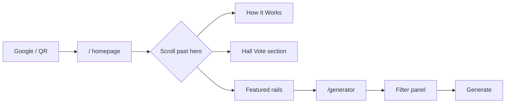

**Friction:** 5+ CTAs, hero 56–88dvh, browse paths compete with generator.

### v3

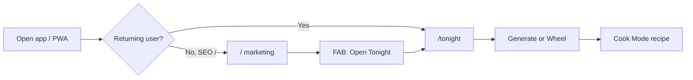

| Step | Screen | Action |
|------|--------|--------|
| 1 | `/tonight` | Land on hub — two buttons |
| 2 | `/tonight/generate` | Crew size pre-filled from profile or 8 |
| 3 | Tap **Generate** | Recipe card |
| 4 | Auto | **Cook Mode** opens |

**Removed steps:** Homepage sections, header nav choice, "Find a Meal" vs "Pick Tonight's Meal" decision.

---

## 2. Sign up & join hall

**Goal:** Invite link → signed in → Hall tab → ready to vote.

### Today (v2)

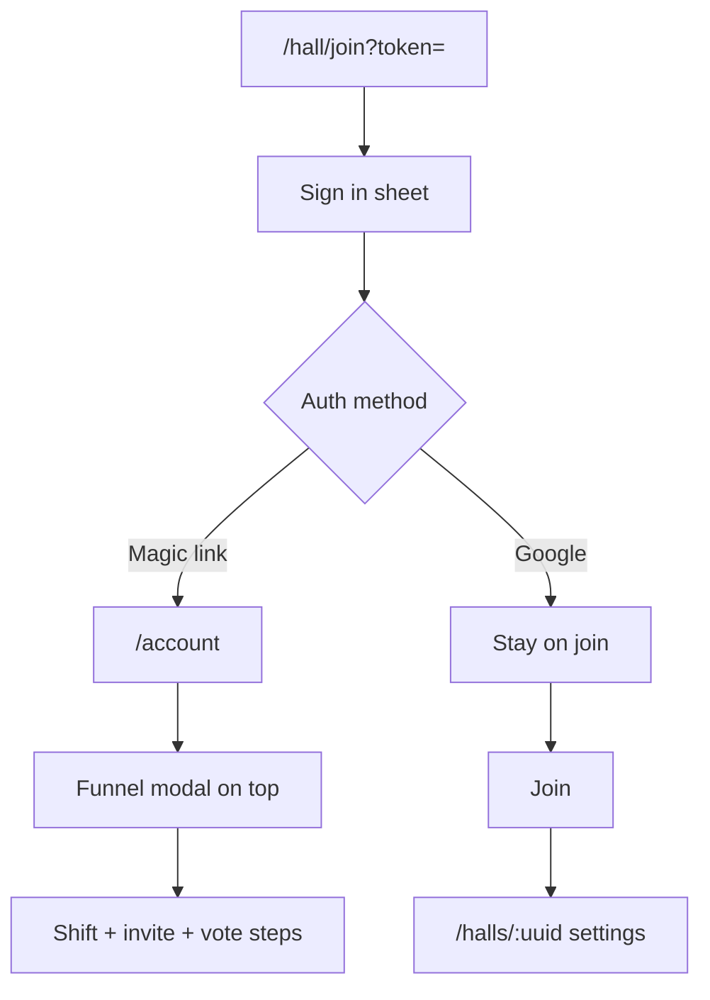

**Friction:** Lost invite context, funnel stacks on join page, lands on settings.

### v3

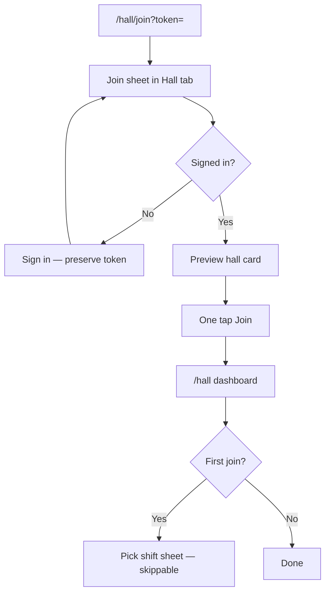

| Step | Screen | Notes |
|------|--------|-------|
| 1 | Hall tab | Join sheet auto-opens from deep link |
| 2 | Sign in | OAuth or magic link **returns to join sheet** |
| 3 | Preview | Hall name, member count |
| 4 | Join | Single CTA |
| 5 | `/hall` | Dashboard — not settings |
| 6 | Shift picker | Bottom sheet; skip if captain assigned role |

**Removed:** Activation funnel steps 3–4 for joiners; duplicate manual code form; `/account` detour.

---

## 3. Captain creates hall

**Goal:** One setup path → crew invite → Hall tab.

### Today (v2)

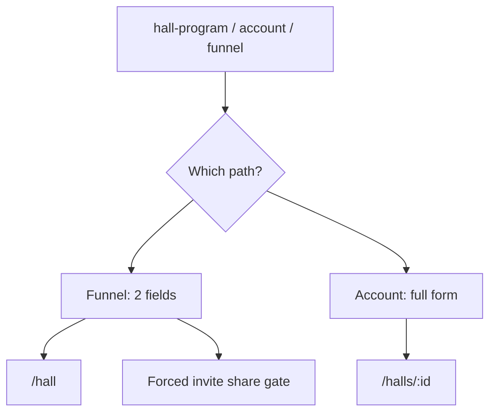

### v3

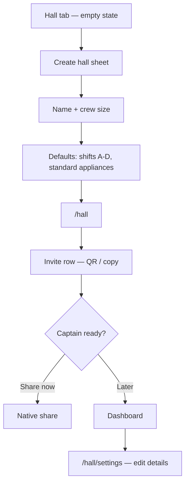

| Step | Screen | Notes |
|------|--------|-------|
| 1 | Hall tab | "Create your hall" |
| 2 | Sheet | Minimal required fields |
| 3 | `/hall` | Dashboard immediately |
| 4 | Invite row | Optional — not gated |
| 5 | Settings | Full station/dept/shifts when ready |

**Removed:** Parallel `CreateHallForm` on Me tab; hall-program sign-in without intent; funnel modal over other pages.

---

## 4. Shift night dinner (hall cook)

**Goal:** Decide → crew buy-in → list → cook — without leaving app mental model.

### Today (v2)

```
/hall → Pick meal → /generator
     → Start vote → modal
     → Shopping → /halls/:id#hash
     → Recipe → blog layout → hunt Cook Mode
```

### v3

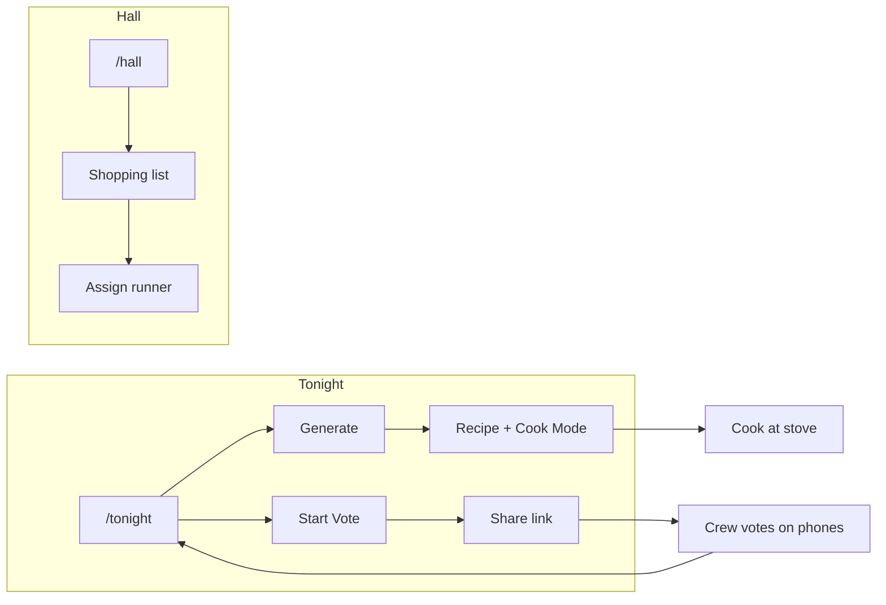

| Phase | Tab | Actions |
|-------|-----|---------|
| Decide | Tonight | Generate or Wheel |
| Align crew | Tonight | Vote card on hub + share |
| List | Hall | Shopping list row → check items |
| Cook | Tonight | Cook Mode from tonight's pick card |

**Key fix:** Tonight hub shows **active vote** and **tonight's pick** so cook doesn't re-navigate.

---

## 5. Crew vote

### Today (v2)

| Role | Path |
|------|------|
| Organizer | Generator / wheel / hall dashboard → modal → copy link |
| Voter | `/vote/:id` orphan page, no nav |

### v3

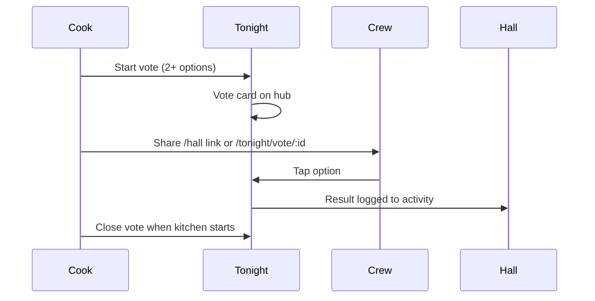

| Organizer | Voter |
|-----------|-------|
| Tonight → Vote → options from recent gens | Opens link → stays in Tonight chrome |
| Share via native sheet | One tap vote |
| Live results on Tonight hub | "Back to Hall" after vote |

**Removed:** Orphan vote page aesthetic; synthetic ballot filler hidden behind "add another option."

---

## 6. Wheel tie-break

### v3 (single tab)

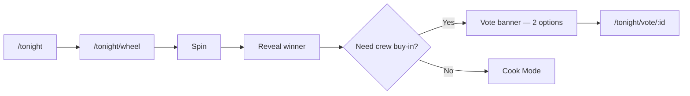

Wheel never lives outside Tonight tab. Explore link on wheel → Discover collection "Classics."

---

## 7. Shopping run

### Today (v2)

```
Recipe modal → Add to hall list
/hall → Shopping tile → /halls/:id#hall-shared-shopping-list
Paywall → settings → captain enables Pro → scroll back
```

### v3

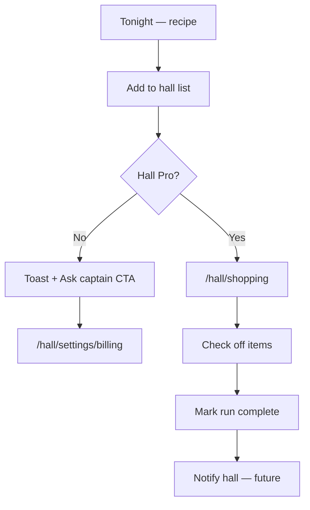

| Step | Who | Screen |
|------|-----|--------|
| 1 | Cook | Tonight → add from recipe |
| 2 | Anyone | Hall → Shopping list |
| 3 | Runner | Check items in aisle |
| 4 | Captain / canteen mgr | Mark complete |

**Removed:** Hash navigation; settings page as grocery UI.

---

## 8. Canteen restock

### Today (v2)

| Action | Where |
|--------|-------|
| Report low stock | Shift dashboard modal only |
| View all statuses | `/hall/canteen` |
| Manage purchases | Canteen manager on canteen page |
| Hall supplies (Pro) | Settings page panel |

### v3

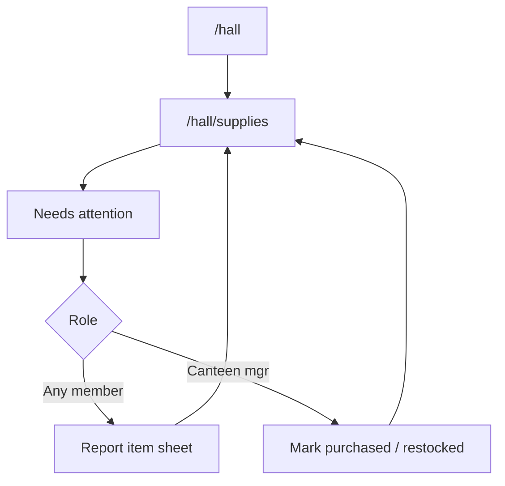

| Screen | Content |
|--------|---------|
| `/hall/supplies` | Unified: canteen statuses + hall supply SKUs |
| Report sheet | Available from supplies page **and** shift view |
| Shift quick report | Deep link → same sheet |

**Removed:** Split report (shift only) vs manage (canteen only) discovery problem.

---

## 9. Browse & save to hall

### v3

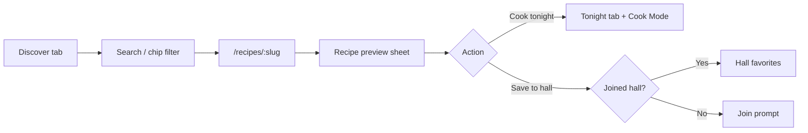

Discover opens recipe as **sheet** over tab bar; "Cook tonight" hands off to Tonight tab with context.

---

## 10. Hall Pro upgrade

### Today (v2)

Paywall on settings → "View plans" → personal plans page → user confused.

### v3

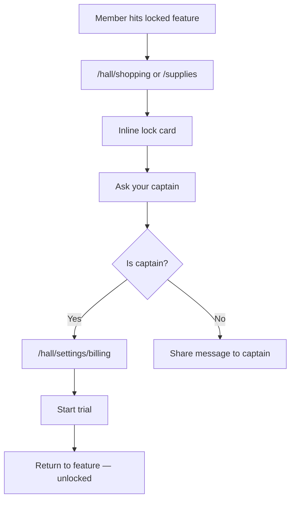

| User | Experience |
|------|------------|
| Member | Never sees `/me/plans` for hall features |
| Captain | Billing only under Hall settings |
| `/me/plans` | Personal tier only |

---

## 11. Return visit

### v3 default routing

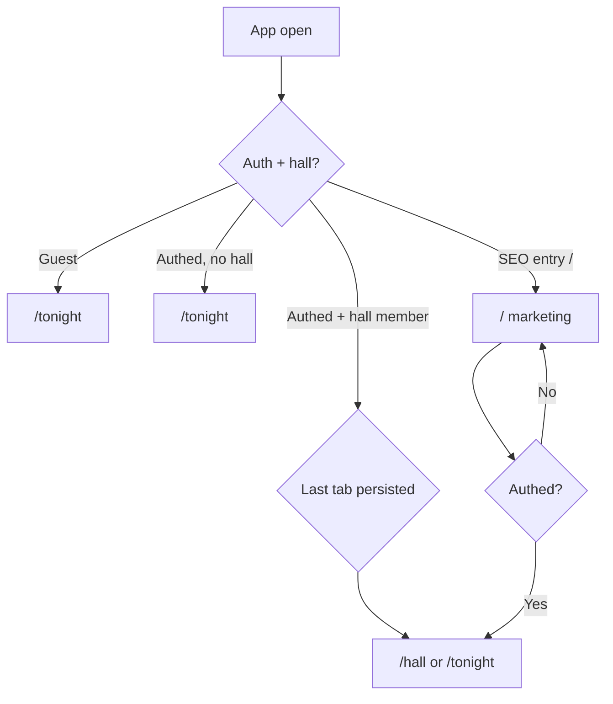

| Signal | Default tab |
|--------|-------------|
| Within 2h of shift start (reminder) | Hall |
| Active vote exists | Tonight |
| Default | Last used tab or Tonight |

---

## Cross-flow comparison

### Navigation depth (tap count to goal)

| Goal | v2 taps | v3 taps |
|------|---------|---------|
| Generate meal | 2–4 (home → nav → generator) | 1–2 (Tonight → Generate) |
| Join hall from invite | 4–7 (+ wrong landing) | 2–3 (Hall sheet → Join) |
| Hall shopping list | 3–5 (+ scroll hash) | 2 (Hall → Shopping) |
| Cook at stove | 3+ (recipe → find Cook Mode) | 1 (auto Cook Mode) |
| Report canteen item | 4+ (find shift page) | 2 (Hall → Supplies → Report) |

### Modal vs route policy (v3)

| Use modal/sheet | Use full route |
|-----------------|----------------|
| Sign in | Discover grid |
| Join / create hall | Tonight generate |
| Personal shopping list | Hall shopping |
| Vote create (quick) | Vote participate (share URL) |
| Recipe preview from Discover | Cook Mode |
| Report supply item | Hall settings |

---

## Persona quick paths

### Probie (first week)

```
Invite link → Hall tab join → /hall
Tonight tab → Generate → Vote link to crew
```

### Senior (skeptic)

```
Tonight tab → Wheel → Cook Mode
(No account required)
```

### Hall cook (shift night)

```
Tonight: Generate + Vote
Hall: Shopping list
Tonight: Cook Mode
```

### Canteen manager

```
Hall → Supplies → report / purchase
(Optional) Hall → Shopping for joint run
```

### Captain (setup once)

```
Hall → Create → Invite row
Hall → Settings → Billing (Hall Pro)
Never blocks crew on onboarding funnel
```

---

## Implementation checklist (flows)

| Flow | Depends on |
|------|------------|
| Join → `/hall` | Redirect fix + join sheet |
| Tonight hub state | Active vote API on hub load |
| `/hall/shopping` | Extract panel from settings |
| Cook Mode default | Recipe open handler |
| Magic link return URL | Auth redirect with `?next=` |
| Tab bar | `AppTabShell` component |
| Paywall CTA | Point to `/hall/settings/billing` |

---

## Related documents

| Doc | Contents |
|-----|----------|
| `screen-map-v3.md` | Every route, duplicates, orphans |
| `navigation-v3.md` | Tab IA, chrome, migration phases |
| `firefighter-user-journeys.md` | Persona pain points that drove v3 |

---

*End of user flows v3.*
